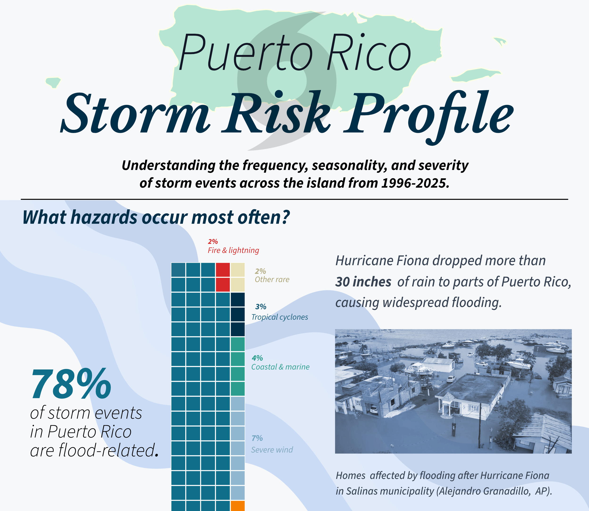

  

::: {#hero-heading}

Recent graduate with a <strong>Master in Environmental Data Science</strong> from the Bren School at UCSB. I’m building a career in development, data stewardship, database management, and analysis with a focus on environmental applications.  

[More about me](about.html){.btn .btn-secondary role="button"}
:::

<!-- end hero-heading -->

  

:::{.column-screen style="background-color:#c3b29d"}
:::{.home-column-screen-inset}

:::{.home-column-text.col-left}
## A Smarter Way to Explore Biodiversity Data

The Bio Weaver tool is a spatial data application that helps explore biodiversity data in California.

*Python • GIS • Data Engineering • Reproducible Workflows*

[View Project →](posts/2026-09-05-bioweaver-tool/index.qmd){.btn .btn-secondary role="button"}
:::

:::{.home-column-image.col-right}
:::: {.carousel controls="false" indicators="false" duration=5000}

:::: {.carousel-item image="img/slide-1-carousel-homepage.gif"}
::::

:::: {.carousel-item image="img/slide-2-carousel-map.gif"}
::::

:::: {.carousel-item image="img/slide-3-carousel-pto.gif"}
::::
:::

:::
:::

:::

 

## Highlights

Here is some of my other work!

:::: {.home-grid-container}
::: {.home-grid}
::: {.home-grid-item}
{.home-thumb} 

### Puerto Rico Storm Profile Infographic
Designed a storm‑risk infographic used to communicate hazard exposure to non‑technical audiences.

  
[View Project →](posts/2026-03-09-pr-storms-infographic/index.qmd){.btn .btn-secondary role="button"}
:::
::: {.home-grid-item}

{.home-thumb}

### SF Bay Water Quality Database
Built a relational water‑quality database enabling fast queries for environmental monitoring.

  
[View Project →](posts.qmd){.btn .btn-secondary role="button"}
:::
::: {.home-grid-item}

{.home-thumb}

### Aquaculture Suitability Analysis
Modeled coastal suitability for aquaculture using spatial data and environmental constraints.

  

[View Project →](posts/2025-12-06-aquaculture-suitability/index.qmd){.btn .btn-secondary role="button"}
:::
:::
::::

