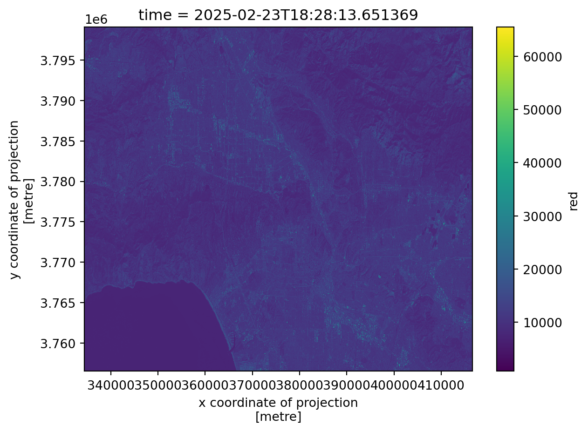
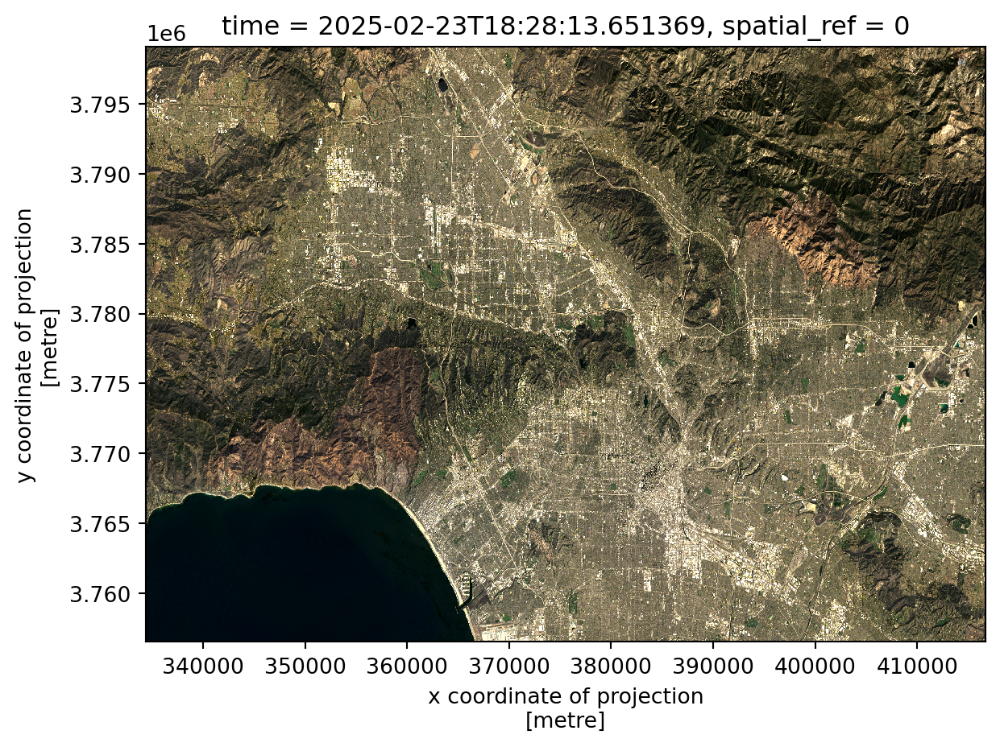
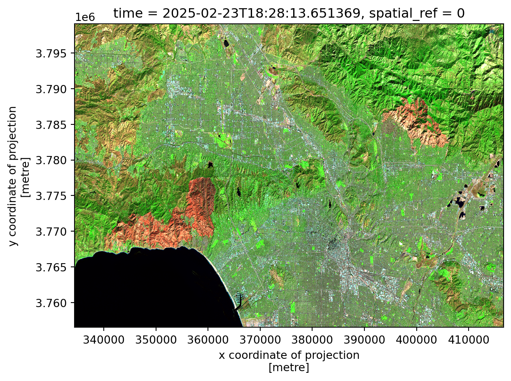
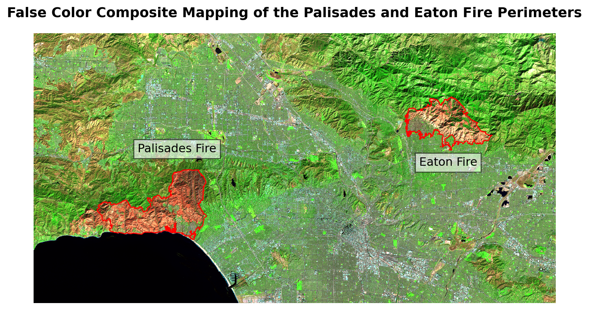
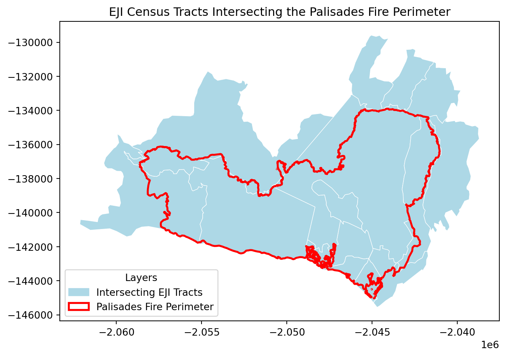
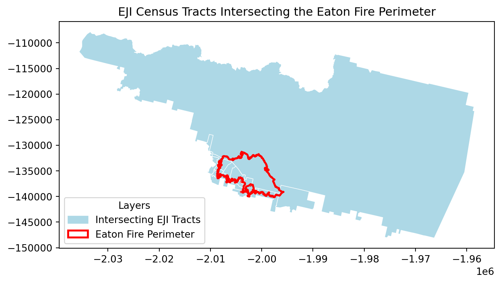
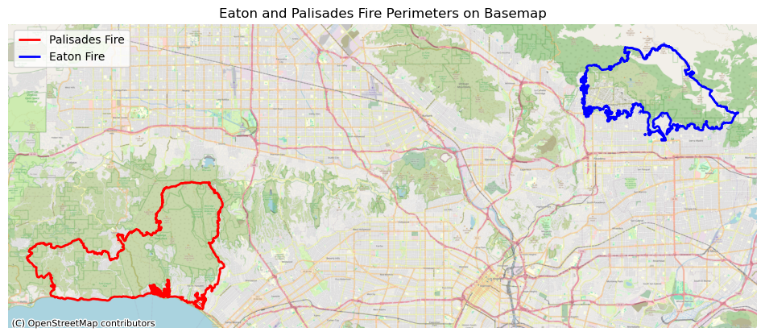
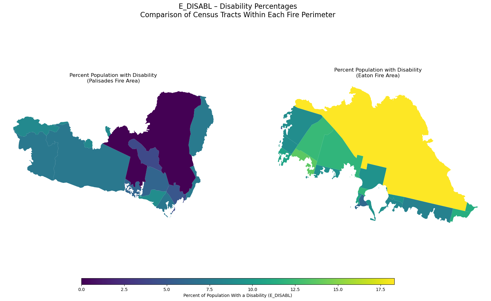

You can access the link to the GitHub Repository for more information about this project [here](https://github.com/mmorenorolon/eaton-palisades-eji-false-imagery.git).

## **Background**:

In early 2025, wildfires burned across Southern California, including the Eaton and Palisades fires in Los Angeles County. This event forced communities to evacuate and caused widespread damage to homes, infrastructure, and natural landscapes. While firefighting efforts eventually contained the flames, the risks associated with these events did not end with fire suppression. According to the USDA Forest Service, burned hillslopes left behind by these fires became highly vulnerable to secondary hazards such as flash flooding, erosion, and mudslides during subsequent rain events. Scientists from the USDA Forest Service’s Rocky Mountain Research Station and interagency response teams deployed post-fire assessment tools to identify areas most at risk and to support mitigation efforts aimed at protecting downstream communities and critical infrastructure (Saunders, 2025).

These post-fire risks highlight the importance of understanding not only where wildfires occur, but also how their impacts intersect with the landscapes and communities affected by them. In response to this need, I examined the extent of the damage and social vulnerability wrought by the Eaton and Palisades fires. First, I used Landsat 8 false-color imagery to visualize burn scars by assigning infrared bands to visible color channels, allowing burn severity and the spatial extent of damage to be clearly identified. Secondly, my analysis integrates Environmental Justice Index (EJI) data with official fire perimeters to explore the social dimensions of wildfire impacts. Together, these approaches demonstrate how geospatial data science can be used to assess both the physical effects of wildfires and the uneven social conditions that shape community vulnerability and recovery.

## **Highlights**

- **Fire Perimeter Processing**

Used `geopandas` to import, clean, reproject, and merge Eaton and Palisades fire perimeter shapefiles. Confirmed consistency in CRS and prepared the data layers for spatial analysis and satellite overlay.

- **Satellite Imagery Handling & False-Color Composites**

I loaded Landsat 8 surface reflectance data with `xarray` and restored missing CRS information. I created both true-color (RGB) and false-color (SWIR–NIR–Red) composites using `matplotlib` to highlight burn scars and vegetation loss.

- **Environmental Justice Analysis**

Imported California Environmental Justice Index (EJI) data to perform spatial joins and clip operations with `geopandas`. I used `pandas` to isolate for the social-vulnerability variable of interest (`E_DISABL`) which represents the percent of residents with a disability.

- **Geospatial Visualization for Community Impact Assessment**

Combined the fire perimeters, satellite imagery, and EJI demographic data into comparative maps using `matplotlib` and `contextily` to reveal how wildfire footprints intersect with socially vulnerable communities in Los Angeles County.

## **About the Data: Dataset Description**

#### **Landsat Data**:

The NetCDF dataset `landsat8-2025-02-23-palisades-eaton.nc` contains atmospherically corrected surface reflectance data from the Landsat 8 satellite, published on February 23, 2025 through the [Microsoft Planetary Computer](https://planetarycomputer.microsoft.com/dataset/landsat-c2-l2). It includes key spectral bands (red, green, blue, near-infrared, and shortwave infrared) clipped to the perimeters of the Eaton and Palisades Fires in Los Angeles County. The dataset stores geospatial metadata in the `spatial_ref` variable. With a spatial resolution of 30 meters, this dataset supports the creation of true color and false color composites to assess vegetation health, burn severity and the extent of fire scars. Date Accessed: 11/19/2025

#### **Fire Perimeter Data**:

The Palisades and Eaton Dissolved Fire Perimeters (2025) dataset, published on January 21, 2025 by the County of Los Angeles, provides dissolved boundary polygons for the Eaton and Palisades Fires. Derived from the NIFC FIRIS fire service, which originally contained daily perimeter snapshots, the boundaries were merged to create a single burn perimeter for each fire. One Eaton record (mission 2025-CALAC-009087) was excluded because buffered “destroyed” points did not reliably represent burned areas. The dataset is hosted on [ArcGIS Hub](https://hub.arcgis.com/maps/ad51845ea5fb4eb483bc2a7c38b2370c/about) and includes geospatial layers for both fire perimeters, which supports wildfire impact analysis, mapping and environmental monitoring. Date Accessed: 11/19/2025

#### **Environmental Justice Index Data**:

The [Environmental Justice Index](https://www.atsdr.cdc.gov/place-health/php/eji/eji-data-download.html) (EJI) dataset provides census-tract-level indicators that capture the social and demographic conditions shaping a community’s ability to prepare for, respond to, and recover from environmental hazards. The dataset includes variables related to socioeconomic status, housing and transportation, health vulnerability, and population characteristics. For this analysis, we downloaded the EJI data for California in 2024. This analysis also focuses on the variable `E_DISABL`, which represents the percentage of residents with a disability in each census tract. Date Accessed: 11/21/2025

### Merging Eaton and Palisades Perimeters

The Eaton and Palisades fire perimeter datasets were merged into a single geospatial layer after confirming CRS consistency and compatible attribute structures. A fire identifier field was retained to distinguish between burn perimeters in subsequent analyses.

### Cleaning Column Names 

To make the dataset easier to work with, we standardize column names by converting them to lowercase and renaming fields such as `shape_are` to`area` and `shape_len` to `length`. Clean column names reduce ambiguity and improve readability in subsequent analyses.

After cleaning the column names, I renamed `shape_are` and `shape_len` to `area` and `length`, respectively, to improve readability and ensure the column names were more easily interpretable throughout the analysis.

Now that the fire perimeter data have been imported, merged, and cleaned, we can proceed to preprocess the Landsat NetCDF dataset.

### **NetCDF data import and exploration**

#### Loading the Landsat 8 Bands

After processing the fire perimeter data, I proceeded to load the individual spectral bands from the Landsat 8 dataset. Each band represents reflectance in a different portion of the electromagnetic spectrum. Because false color imagery relies on assigning SWIR, NIR, and Red bands to visible colors, loading these bands correctly is essential for constructing the final composite.

An exploratory overview of the dataset was conducted to identify all available spectral bands, metadata, dimensions, and coordinate information. This step ensures we understand how the dataset is stored and which variables are required for color composite creation.

#### Quick Band Visualization

Plotting a single band provides an initial visual check and helps confirm that the dataset was read correctly. This is a useful diagnostic step before building composite imagery.

#### Summary of Preliminary Exploration for `landsat8`

The dataset shows that the blue band contains 109 missing values, while the green band has only one; all other variables have no missing data. The spatial dimensions are 1418 y‑coordinates by 2742 x‑coordinates. Band values are stored as integers, whereas the time variable is in datetime format. All measurements are expressed in meters, and the dataset is referenced to CRS 'EPSG:32611'. 

## **Restoring Geospatial Information** 

Before the Landsat imagery can be accurately overlaid with the fire perimeter polygons, it is necessary to ensure that the raster dataset contains complete and correctly defined geospatial reference information. Although the NetCDF file includes a `spatial_ref` variable, the coordinate reference system (CRS) is not automatically recognized. In this section, I restore the missing CRS information to properly align the raster and vector datasets in the subsequent visualizations.

In the steps above, we confirmed that the landsat8 dataset did not have a recognized CRS and then extracted the WKT-formatted coordinate reference system stored in the `spatial_ref` variable. In the following step, this CRS was written back to the dataset using `.rio.write_crs()`. This process is essential to ensure proper alignment between the raster dataset and the fire perimeter polygons in subsequent analyses.

## **Creating a True Color Image**

To generate a natural-looking image of the landscape, we combined the red, green, and blue bands.  
Because clouds and bright targets can skew pixel values, we use the `robust=True` parameter to rescale the display range and improve visualization. We also address missing values by replacing NaNs with zeros to avoid rendering warnings.

The green and blue bands have missing values.

### True Color Image Generation Takeaways
Because clouds are extremely bright, they can stretch the display scale, causing non-cloud pixels to be compressed into a narrow range and making the image appear nearly blank. Setting the `robust=True` parameter instructs `xarray` to ignore extreme outliers, which resolves this issue and allows surface features to become visible. To further assess data quality, I used `landsat8.isnull().sum()` to identify missing values across spectral bands and revealed that there were NaN values in the green and blue bands. These missing values were addressed by applying `fillna(0)` prior to generating the true-color image.

While the true-color composite provides a realistic view of the landscape, it can still obscure burn scars and vegetation stress, particularly in complex post-fire environments. For this reason, we create a false-color composite, which leverages infrared bands to more effectively distinguish burned areas and variations in vegetation health.

## **Creating a False Color Composite**

To highlight burn scars and vegetation health, we combine three Landsat bands into a false color image:

- **SWIR** → **Red channel**
- **NIR** → **Green channel**
- **Red** → **Blue channel**

This band arrangement enhances the visibility of burned regions and stressed vegetation. Therefore, this visualization will make it easier to interpret fire impacts across the Palisades and Eaton areas.

With the false-color composite successfully generated, the next step is to overlay the Eaton and Palisades fire perimeters using the boundary data processed earlier. This allows the spatial extent of the burn scars to be directly compared with the official fire boundaries.

### **Reprojecting Raster and Vector Data**

The Landsat imagery and fire perimeter shapefiles may use different coordinate reference systems (CRS). To properly overlay perimeter polygons on the raster data, we reproject both datasets into a common CRS. This ensures that pixel locations align with fire boundaries on the map.

## Mapping Fire Perimeters with a False Color Composite

In this final visualization, we overlay the Eaton and Palisades fire boundaries on the false color image.  
This map reveals which areas exhibit increased SWIR reflectance, which is a strong indicator of recent burns, and confirms alignment with official fire perimeters. Text annotations help distinguish each fire footprint.

**More About the Use of False Color Imagery in this Figure**

The image above used the shortwave infrared (SWIR), near-infrared (NIR), and red band combination, which highlights the visibility of burned areas and stress on vegetation. In this false color scheme, healthy vegetation appears in bright green
In this combination, shortwave infrared (SWIR) is assigned to the red display channel, near-infrared (NIR) to green, and red light to blue. Burn scars appear in deep red tones, while SWIR reflectance increases after vegetation burns due to the loss of water content and exposure of burned soil. Vegetation reflects strongly in the NIR, which is mapped to the green channel in this composite, while Urban areas and developed land appear in shades of cyan or gray. Water appears very dark or black because both SWIR and NIR are almost completely absorbed by water. These spectral relationships allow the burned areas from the Palisades and Eaton fires to stand out strongly against the surrounding landscape. The fire perimeters (shown as transparent red polygons) align with the regions of intense SWIR reflectance. This map confirms the extent of the burn scars captured by Landsat.

While false-color imagery is effective for identifying the spatial extent and severity of wildfire damage, it captures only the physical impacts on the landscape. To fully understand the consequences of the Eaton and Palisades fires, it is also necessary to examine how these burned areas intersect with nearby communities and their social characteristics. In the next section, the analysis shifts from satellite-based burn mapping to a social vulnerability perspective by integrating Environmental Justice Index (EJI) data with the fire perimeters to explore how wildfire exposure overlaps with populations that may face additional challenges during response and recovery.

## **Social dimensions of the Eaton and Palisades Fires**

Wildfires do not impact all communities equally. Beyond the physical footprint of a burn scar, the social and demographic characteristics of nearby neighborhoods play a crucial role in shaping how residents experience, respond to, and recover from wildfire events. In this section, I explore the social dimensions of the Eaton and Palisades Fires by integrating census-tract–level indicators from the Environmental Justice Index (EJI) with each fire’s geographic perimeter.

### Importing EJI Data

First, the data were imported and the Palisades and Eaton fire polygons were reprojected to a common coordinate reference system (CRS) before performing the spatial join. The purpose of the spatial join is to identify which Environmental Justice Index (EJI) census tracts intersect the Eaton and Palisades fire perimeters. By retaining only the census tracts that spatially overlap the fire boundaries, the spatial join links geographic exposure to wildfire with tract-level social and demographic attributes. This step allows the analysis to focus specifically on communities that were directly affected by the fires.

In the case of the Palisades Fire, several entire census tracts fall completely inside the fire perimeter, while others intersect only along the edges. This means the fire footprint is large relative to the size of nearby census tracts, covering substantial portions of the local communities. Unlike many wildfires that only clip small parts of multiple tracts, the Palisades Fire burned through whole tracts, indicating that the impacted population and built environment may span multiple full census units. The same process was repeated for the Eaton fire perimeter, resulting in a dataset of EJI census tracts that intersect the fire boundary.

Like the Palisades fire, the Eaton fire boundary is small relative to the size of census tracts. Only a few tracts intersect the fire perimeter, and each tract contains a much larger land area than the fire itself. This illustrates that tract-level EJ metrics aggregate social information across regions far larger than the fire footprint.

#### Clipping Census Tracts to Fire Perimeters

After identifying the census tracts that intersect each fire perimeter using spatial joins, the next step is to refine the analysis by clipping the Environmental Justice Index (EJI) census tracts to the exact boundaries of the Palisades and Eaton fires.

#### Difference Between a Spatial Join and Clipping

**Spatial Join `gpd.sjoin()`**

Returns entire census tracts that touch the fire perimeter and the geometry remains unchanged. 

**Clipping `gpd.clip()`**

Returns only the portion of each tract inside the fire perimeter and the geometry is modified.

###  Creating a Visualization with the Eaton and Palisades Fire Perimeters

In this visualization, the Eaton and Palisades fire perimeters are overlaid on a basemap using the `contextily` library to provide geographic context. Displaying both boundaries together helps illustrate their relative locations and extents within Los Angeles County and supports interpretation of subsequent spatial analyses.

{fig-align="center"}

The map above displays the locations and extents of the Palisades Fire (outlined in red) and the Eaton Fire (outlined in blue) over a detailed OpenStreetMap basemap of the Los Angeles region. Overlaying the fire boundaries on a familiar street-level basemap allows for clear interpretation of their urban and ecological contexts. This map shows the proximity of the perimeters to major roadways, neighborhoods and parks.

## **From Physical Burn Severity to Social Impact**

After establishing the geographic context of the Eaton and Palisades fires using a basemap and official fire perimeters, I examined social vulnerability within the affected areas. I plotted census tracts symbolized by the percentage of persons with a disability (`E_DISABL`) using the 2024 California Environmental Justice Index dataset. This map highlights the spatial distribution of disability prevalence among census tracts intersecting the Eaton and Palisades fire perimeters. This visualization allows for a clearer understanding of how wildfire exposure overlaps with communities that may face additional challenges during evacuation, emergency response, and recovery. By visualizing this variable at the census-tract level, the map provides critical context for understanding social vulnerability alongside the physical extent of the fires.

{fig-align="center"}

The distribution of `E_DISABL`, or the percent of residents with disabilities, differs noticeably between the census tracts intersecting the Palisades and Eaton fire perimeters. In the Palisades area, disability percentages are generally lower and more varied, with many tracts falling in the lower end of the color scale. In contrast, the Eaton fire area shows consistently higher disability rates across most tracts, with several communities displaying some of the highest values in the comparison. These differences have important implications for wildfire relief and recovery efforts. Communities with higher proportions of residents with disabilities may face additional challenges during evacuation, communication, and rebuilding phases. This means that emergency managers and recovery planners may need to allocate more targeted resources like accessible transportation, medical support, and long-term housing assistance to the Eaton area to ensure equitable and effective wildfire response.

## Conclusion

This project combined remote sensing imagery and Environmental Justice Index data to examine both the physical and social impacts of the Eaton and Palisades wildfires. While false-color Landsat imagery effectively highlighted burn severity and fire extent, integrating demographic indicators revealed meaningful differences in social vulnerability across affected communities. Altogether, these analyses demonstrate how the use of geospatial data can support more equitable disaster response and recovery planning.

## **References:**

Centers for Disease Control and Prevention and Agency for Toxic Substances Disease Registry. (2024). *Environmental Justice Index [Dataset]*. https://atsdr.cdc.gov/place-health/php/eji/eji-data-download.html

County of Los Angeles. (2025). *Palisades and Eaton dissolved fire perimeters (Version 1.0) [Dataset]*. ArcGIS Hub. https://hub.arcgis.com/maps/ad51845ea5fb4eb483bc2a7c38b2370c/about

Galaz García, C. (2025). *Final project*. EDS - 220 Working with Environmental Datasets. Retrieved from https://meds-eds-220.github.io/MEDS-eds-220-course/assignments/final-project.html

Microsoft. (2025). *landsat8-2025-02-23-palisades-eaton.nc (Version 1.0) [Dataset]*. Microsoft Planetary Computer. https://planetarycomputer.microsoft.com

Saunders, L. (2025) . *Science supports Los Angeles wildfires’ aftermath: Data detects danger — Scientific tools mitigate flash flood and mudslide risks*. USDA Forest Service. https://www.fs.usda.gov/about-agency/features/science-supports-los-angeles-wildfires-aftermath

