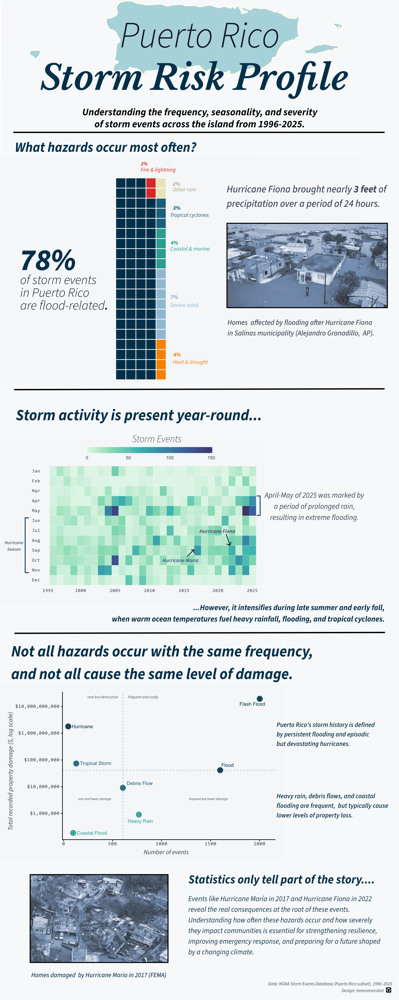
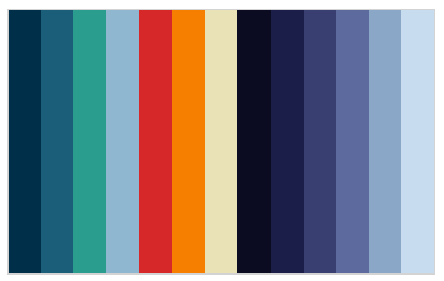

## The Motivation Behind This Infographic

Growing up in Puerto Rico means storms are part of the rhythm of life. Hurricanes, floods, and severe rain events shape everything from the island’s infrastructure to the way communities prepare, rebuild, and support one another. These experiences are woven into my understanding of home, and they’re a major reason I gravitate toward projects that make environmental data more accessible.

With this infographic, I wanted to translate those lived realities into a clear, data‑driven story. By examining which hazards occur most often, when they tend to happen, and how much economic damage they cause, I hoped to create a visual summary that reflects both the frequency of everyday flooding and the outsized impact of rare but devastating hurricanes. It’s a way of grounding personal experience in evidence and helping others see the patterns that shape life on the island.


## The Questions Guiding This Project

To better understand Puerto Rico's hazard landscape, I asked three questions:

- **Which hazards dominate storm records in Puerto Rico?**
- **When during the year do these hazards occur most frequently?**
- **Which hazards cause the greatest economic losses?**

These questions shaped both the structure of the infographic and the data I chose to work with. To answer them, I used the NOAA Storm Events Database, focusing on the years 1996–2025. NOAA expanded and standardized storm event reporting in 1996, which is why I restricted my analysis to 1996–2025. Before 1996, only a few event types were recorded consistently, making earlier data difficult to compare across hazards^[NCEI. Storm Events Database. Noaa.Gov. https://www.ncei.noaa.gov/stormevents/details.jsp].

By examining event type, property damage, and detailed date information, I distilled thousands of storm reports into a visual summary that highlights the patterns most relevant to life on the island: the dominance of flood‑related hazards, the rhythm of seasonality, and the outsized economic impact of rare but severe events like hurricanes.




The infographic highlights three key patterns. First, flood-related hazards dominate Puerto Rico’s storm records. Second, storm activity peaks during the Atlantic hurricane season between August and October. Finally, while hurricanes are relatively rare events, they account for some of the largest economic losses.

## My Approach to Visual Storytelling

Selecting the right visualization for each part of this project was essential to tell a clear, cohesive story about storm hazards in Puerto Rico. Each plot answers a different question: the what, when, and so what. Together, they build a complete picture of risk.

### Waffle chart: What hazards occur most often?

I chose a waffle chart to communicate the composition of storm events across Puerto Rico. Because each square represents one percent of all recorded events, the viewer can immediately grasp the dominance of flood‑related hazards, which make up nearly four‑fifths of all reports.

### Heatmap: When do storm events happen?

The heatmap reveals the seasonality of storm activity over three decades. By mapping event counts across month‑year combinations, the visualization highlights clear clustering during the June–November hurricane season, while also showing that other storm events, especially heavy rain and flooding, occur throughout the year.

### Scatter plot: How severe are these events?

The scatter plot compares event frequency with total recorded property damage to allow for a direct look at the trade‑offs between how often hazards occur and how destructive they are.

## Structuring The Infographic

The visual hierarchy of the infographic is designed to guide the reader through the story in a clear, intuitive way. Each section answers a progressively deeper question about storm hazards in Puerto Rico, moving from broad context to a more granular insight. The flow follows an overview - pattern - consequence structure. After generating the plots in R, I refined their layout and alignment in Affinity Designer. 
## Color Palette



The color palette for this infographic was chosen to evoke a storm‑themed, coastal atmosphere while also maintaining clarity, accessibility, and consistency across all visual elements. Because the data focus heavily on flood‑related hazards, the palette centers on cool blues and teals, which are also supported by warm accent colors for contrast and semantic meaning. To keep the infographic cohesive, the same palette is used across all three charts, the background, and the toned FEMA/AP photographs. 


## Typography

I used a simple typographic system to keep the infographic clear and readable. ***Libre Baskerville*** to give the title an editorial feel, while ***Source Sans 3*** keeps the body text, labels, and annotations clean and accessible.

## Accessibility & DEIJ Considerations

Designing this infographic also meant thinking about who would be reading it and how to make the information as accessible and inclusive as possible. I chose high‑contrast colors, readable font weights, and clear labeling to support viewers with varying levels of visual acuity.

## Challenges And Trade‑offs

One of the biggest hurdles was figuring out how to represent economic losses. Property damage values in the dataset are skewed, since many events report zero damage, while a handful of hurricanes account for almost all recorded losses. Because of this, I opted to use total cumulative property damage instead. Another challenge was deciding how to group event types. NOAA’s database includes dozens of categories, some of which are redundant or inconsistently used. I had to strike a balance between staying true to the raw data and creating categories that made sense to readers. Throughout the design process, I kept running into the tension between wanting to show nuance and wanting the infographic to remain readable. Removing them made the visualization cleaner and sharpened the narrative around flood‑related hazards, which dominate the dataset. In addition to this, I had to design the heatmap using a restrained color scale and avoid visual modifications that would artificially amplify the pattern.

## Full R Code

All of the visualizations in this project were generated using R code.
Expand the code chunk below to explore the full workflow!

```{r,results='hide',eval=FALSE}
# Load libraries
library(lubridate)
library(ggplot2)
library(scales)
library(viridis)
library(tidyverse)
library(janitor)
library(here)
library(waffle)


#----------------------- raw data --------------------------------------

# Save all data files
storm_files <- list.files(
  path = "C:/Documents/MEDS/EDS240 - data visualization/eds240-infographic/data",
  pattern = "\\.csv$",
  full.names = TRUE
)

# Read in all data files and merge as one dataframe
storm_raw <- storm_files %>%
  map_dfr(
    ~ read_csv(.x, col_types = cols(.default = col_character()))
  )

storm_clean <- storm_raw %>% 
  # Convert variables to numeric
  mutate(across(.cols = c(DEATHS_DIRECT, DEATHS_INDIRECT, INJURIES_DIRECT, INJURIES_INDIRECT, DAMAGE_PROPERTY_NUM, DAMAGE_CROPS_NUM, MAGNITUDE, BEGIN_RANGE, END_RANGE), ~ parse_number(.x))) %>%
  
  # Standardize time strings
  mutate(
    BEGIN_TIME = str_pad(BEGIN_TIME, width = 4, side = "left", 
                         pad = "0"),
    END_TIME = str_pad(END_TIME,   width = 4, side = "left", 
                       pad = "0")) %>% 
  
  # Convert dates and derive time features
  mutate(BEGIN_DATE = mdy(BEGIN_DATE),
         END_DATE = mdy(END_DATE),
         YEAR = year(BEGIN_DATE),
         BEGIN_HOUR = as.integer(substr(BEGIN_TIME, 1, 2)),
         END_HOUR = as.integer(substr(END_TIME, 1, 2))) %>% 
  
  # Select only the variables that will be used for analysis
  select(EVENT_ID, EPISODE_ID,
         STATE_ABBR, CZ_NAME_STR, CZ_TYPE, CZ_FIPS,
         EVENT_TYPE, MAGNITUDE, MAGNITUDE_TYPE,
         BEGIN_DATE, END_DATE, YEAR, BEGIN_HOUR, END_HOUR,
         DEATHS_DIRECT, DEATHS_INDIRECT,
         INJURIES_DIRECT, INJURIES_INDIRECT,
         DAMAGE_PROPERTY_NUM, DAMAGE_CROPS_NUM,
         SOURCE, FLOOD_CAUSE) %>% 
  
  # Standardize variable names
  clean_names()


#-------------------- background theme colors -------------------------------------

bg <- "#F4F6F8"

grid <- "#E5E7EB"   # subtle gridline color

#--------------------- Waffle chart ------------------------------------
pal_waffle <- c(
  "Flood-related"      = "#003049",
  "Tropical cyclones"  = "#1A5E7A",
  "Coastal & marine"   = "#2A9D8F",
  "Severe wind"        = "#8FB8D0",
  "Fire & lightning"   = "#D62828",
  "Heat & drought"     = "#F77F00",
  "Other rare"         = "#EAE2B7"
)

levels_waffle <- c(
  "Flood-related",
  "Fire & lightning",
  "Heat & drought",
  "Severe wind",
  "Coastal & marine",
  "Tropical cyclones",
  "Other rare"
)

legend_labels <- stringr::str_to_title(levels_waffle)

pr_events_collapsed <- storm_clean %>%
  mutate(
    event_type = as.character(event_type),
    hazard_cat = case_when(
      event_type %in% c("Flood", "Flash Flood", "Coastal Flood", "Heavy Rain", "Debris Flow") ~ "Flood-related",
      event_type %in% c("Hurricane (Typhoon)", "Tropical Storm", "Tropical Depression") ~ "Tropical cyclones",
      event_type %in% c("Thunderstorm Wind", "Strong Wind", "High Wind", "Tornado", "Funnel Cloud") ~ "Severe wind",
      event_type %in% c("Excessive Heat", "Drought", "Extreme Cold/Wind Chill") ~ "Heat & drought",
      event_type %in% c("Rip Current", "High Surf", "Waterspout", "Seiche") ~ "Coastal & marine",
      event_type %in% c("Wildfire", "Lightning") ~ "Fire & lightning",
      TRUE ~ "Other rare"
    ))

# Summarize to 100%
pr_event_props <- pr_events_collapsed %>%
  count(hazard_cat) %>%
  mutate(prop = n / sum(n),
         parts = round(prop * 100)) %>%
  arrange(desc(parts))

# Force total squares to be exactly 100
diff <- 100 - sum(pr_event_props$parts)

if (diff != 0) {
  pr_event_props$parts[which.max(pr_event_props$parts)] <-
    pr_event_props$parts[which.max(pr_event_props$parts)] + diff
}

pr_event_props <- pr_event_props %>%
  mutate(hazard_cat = factor(hazard_cat, levels = levels_waffle)) %>%
  arrange(hazard_cat)

waffle_vector <- setNames(pr_event_props$parts, pr_event_props$hazard_cat)

waffle_plot <- waffle::waffle(
  parts = waffle_vector,
  legend_pos = "right",
  size = 0.5,
  rows = 20,
  colors = pal_waffle[names(waffle_vector)]
) +

  theme_minimal(base_size = 14) +
  
  theme(
    
    # Set chart background color
    plot.background = element_rect(
      fill = bg, 
      color = NA),
    panel.background = element_rect(
      fill = bg, 
      color = NA),
    panel.grid = element_blank(),
    
    # Set legend elements
    legend.position = "right",
    legend.title = element_blank(),
    legend.text = element_text(size = 9,
                               lineheight = 1.1),
    
    
    
    axis.title = element_blank(),
    axis.text = element_blank(),
    
    plot.margin = margin(16, 16, 16, 16),
    guides(fill = guide_legend(byrow = TRUE))
  )

waffle_plot

#------------------------------ Heatmap ------------------------------------
heatmap_events <- c(
  "Flash Flood",
  "Heavy Rain",
  "Flood",
  "Coastal Flood",
  "Thunderstorm Wind",
  "High Wind",
  "Strong Wind",
  "Lightning",
  "Hail",
  "Funnel Cloud",
  "Tornado",
  "Waterspout",
  "Debris Flow",
  "High Surf",
  "Tropical Depression",
  "Tropical Storm",
  "Hurricane (Typhoon)"
)

heatmap_filtered <- storm_clean %>% 
  filter(event_type %in% heatmap_events)

heatmap_df <- heatmap_filtered %>%
  mutate(
    month = month(begin_date)
  ) %>%
  filter(!is.na(year), !is.na(month)) %>%
  count(year, month, name = "events") %>%
  complete(
    year  = full_seq(year, 1),
    month = 1:12,
    fill  = list(events = 0)
  )

# Save min and max values for annotations
yr_min <- min(heatmap_df$year, na.rm = TRUE)
yr_max <- max(heatmap_df$year, na.rm = TRUE)

# Helper positions ----------------------------------------------------------
# months (numeric): Jan = 1 ... Dec = 12
y_jun <- 6
y_nov <- 11

# Annotate outside the panel to give ourselves breathing room
x_bracket <- yr_min - 1.1
x_bracket_tick <- yr_min - 0.55   # small ticks to extend toward plot

heatmap_plot <- ggplot(heatmap_df, aes(x = year, y = month, fill = events)) +
  
  # Heatmap tiles without vertical gridlines
  geom_tile(width = 1, height = 1, color = NA) +
  
  # Keep subtle horizontal separators only
  geom_hline(yintercept = seq(1.5, 11.5, by = 1),
             color = "white", linewidth = 0.25,
             alpha = 0.45) +
  
  # --- Jun–Nov bracket outside plot --------------------
annotate("segment",
         x = x_bracket, xend = x_bracket,
         y = y_jun, yend = y_nov,
         linewidth = 0.9, color = "#0B3C5D") +
  
  annotate("segment",
           x = x_bracket, xend = x_bracket_tick,
           y = y_jun, yend = y_jun,
           linewidth = 0.9, color = "#0B3C5D") +
  
  annotate("segment",
           x = x_bracket, xend = x_bracket_tick,
           y = y_nov, yend = y_nov,
           linewidth = 0.9, color = "#0B3C5D") +
  
  # X scale + add left padding for bracket
  scale_x_continuous(
    breaks = pretty_breaks(n = 8),
    limits = c(yr_min - 1.5, yr_max + 0.5),
    expand = c(0, 0)
  ) +
  
  # Months on y reversed so Dec is at the top
  scale_y_reverse(
    breaks = 1:12,
    labels = month.abb,
    limits = c(13.2, 0.5),
    expand = c(0, 0)
  ) +
  
  # Apply mako palette
  scale_fill_viridis_c(
    option = "mako",
    begin  = 0.25,
    end    = 1,
    labels = comma,
    direction = -1
  ) +
  
  labs(
    x = NULL, y = NULL,
    fill = NULL
  ) +
  
  # Legend top + horizontal
  guides(
    fill = guide_colorbar(
      title.position = "top",
      title.hjust = 0,
      barwidth = unit(3.8, "in"),
      barheight = unit(0.18, "in")
    )
  ) +
  
  theme_minimal(base_size = 13) +
  theme(
    plot.background  = element_rect(fill = "#F6F8FA", color = NA),
    panel.background = element_rect(fill = "#F6F8FA", color = NA),
    panel.grid = element_blank(),
    
    # Monospace axis labels so characters align (x + y)
    axis.text.x = element_text(family = "mono", color = "#374151"),
    axis.text.y = element_text(family = "mono", color = "#374151"),
    
    legend.position = "top",
    legend.direction = "horizontal",
    legend.title = element_text(color = "#111827"),
    legend.text  = element_text(color = "#374151"),
    
    # Extra margins so annotations don't get clipped
    plot.margin = margin(16, 18, 14, 70),
    legend.margin = margin(t = 2)
  ) +
  
  # Allow drawing outside the panel
  coord_cartesian(clip = "off")

heatmap_plot

#------------------------- Scatter Plot --------------------------------------
pal_scatter <- c(
  "Flash Flood"           = "#003049",
  "Heavy Rain"            = "#2A9D8F",
  "Flood"                 = "#003049",
  "Coastal Flood"         = "#2A9D8F",
  "Debris Flow"           = "#1A5E7A",
  "Tropical Storm"        = "#1A5E7A",
  "Hurricane (Typhoon)"   = "#003049"
)

scatter_events <- c(
  "Flash Flood",
  "Heavy Rain",
  "Flood",
  "Coastal Flood",
  "Debris Flow",
  "Tropical Storm",
  "Hurricane (Typhoon)"
)
  
scatter_df <- storm_clean %>%
  group_by(event_type) %>%
  summarise(
    events = n(),
    total_damage = sum(damage_property_num, na.rm = TRUE),
    .groups = "drop"
  ) %>%
  filter(event_type %in% scatter_events)

# median reference lines
x_ref <- median(scatter_df$events, na.rm = TRUE)
y_ref <- median(scatter_df$total_damage, na.rm = TRUE)


scatter_plot <- ggplot(scatter_df, 
                        aes(x = events,
                            y = total_damage,
                            label = event_type,
                            colour = event_type)) +
  
  geom_vline(xintercept = x_ref, color = "#9CA3AF", linewidth = 0.4,
             linetype = "dashed") +
  geom_hline(yintercept = y_ref, color = "#9CA3AF", linewidth = 0.4,
             linetype = "dashed") +
  
  geom_point(size = 4.9, alpha = 0.9) +
  
  scale_x_continuous(breaks = scales::pretty_breaks(n = 5),
                     expand = expansion(mult = c(0.03, 0.08))) +
  
  # Set log scale and add a dollar format for values in the y-axis
  scale_y_log10(breaks = scales::breaks_log(n = 5),
                labels = scales::label_dollar()) +
  
  scale_color_manual(values = pal_scatter) +
  
    # Label all point on the chart
  ggrepel::geom_text_repel( size = 3.5,
                            max.overlaps = 20,
                            box.padding = 0.4,
                            point.padding = 0.3,
                            min.segment.length = 0) +
  # Label the chart
  labs(
    x = "Number of events",
    y = "Total recorded property damage ($, log scale)"
  ) +
  
  # Add chart theme
  theme_classic(base_size = 13) +
  theme(panel.background = element_rect(fill = bg, color = NA),
        plot.background = element_rect(fill = bg, color = NA),
        
        # Monospace axis labels so characters align
        axis.text.x = element_text(family = "mono", color = "#374151"),
        axis.text.y = element_text(family = "mono", color = "#374151"),
        
        panel.grid.major = element_blank(),
        panel.grid.minor = element_blank(),
        
        legend.position = "none",
        
        plot.margin = margin(16, 16, 16, 16)
        )

scatter_plot
```

## Citation:

National Centers for Environmental Information (NCEI). Storm Events Database. NOAA. https://www.ncei.noaa.gov/stormevents/


