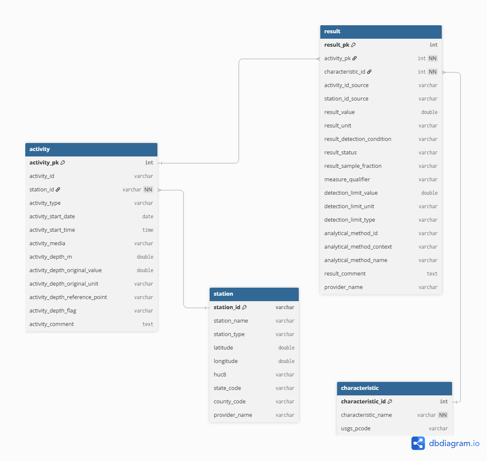
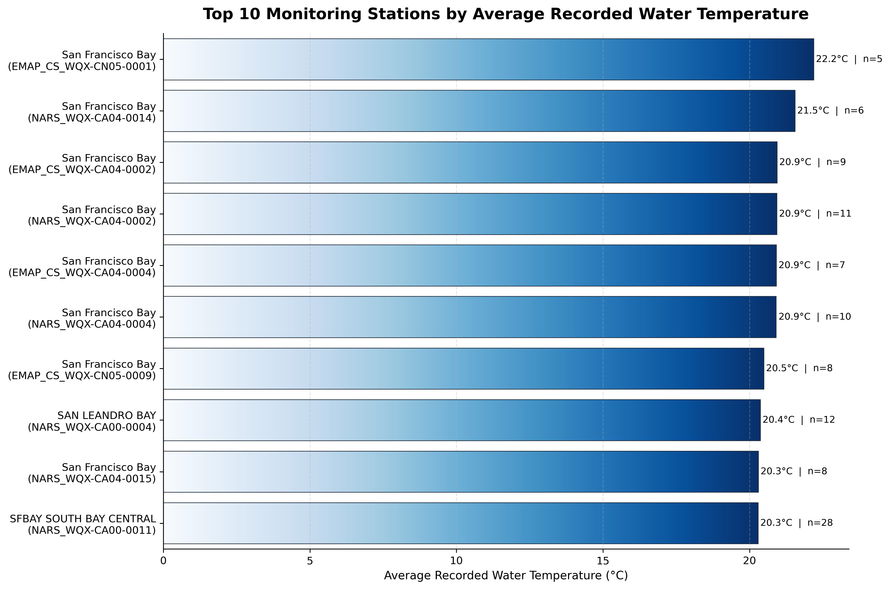

Access the GitHub repository for this project at this [link](https://www.github.com/mmorenorolon/WaterQuality-RDBMS) for more details. 

## Background

San Francisco Bay serves as a crucial estuarine environment on the West Coast. It accounts for 77% of all of California's remaining estuarine wetlands and supports over 130 species of fish (Sierra Club). Estuaries refer to areas where freshwater meets saltwater. This means that even slight changes in conditions could affect the ecosystem’s balance. Therefore, water quality monitoring efforts are important to continue sustainably managing the health of this fragile ecosystem. 

Environmental monitoring programs often collect data from multiple sources. These datasets are frequently distributed as large files that become difficult to query, maintain, and analyze efficiently. They may also contain inconsistencies in measurement standards, missing values, and placeholder values that do not represent real measurements, among other common problems often found in monitoring data.

## Project Overview

This project extracts data from the EPA Water Quality Portal (WQP) to create a relational database that can leverage water quality records to analyze water temperature patterns across monitoring stations in the South Bay of San Francisco. The goal is to organize environmental monitoring data into a structured format that enables efficient querying and analysis of water quality patterns. This database reflects real-world data collection processes by linking monitoring stations, sampling activities, and field measurements. Through this approach, the project cleans real-world environmental data, designs a relational database schema, and extracts information using SQL.

### Key Skills:

This project was completed as part of the final course project requirement for EDS213 – Data & Database Management from the UCSB Master of Environmental Data Science (MEDS) Program. Throughout this project, I applied: 

<span class="pill">Database design</span> <span class="pill">Data modeling</span> <span class="pill">Python scripting</span> <span class="pill">SQL</span> <span class="pill">Data management</span> <span class="pill">Data quality assurance</span>

## Project Motivation

I was motivated to use data from EPA’s WQP because it provides an analytical challenge that most organizational data portals pose. The information stored for a watershed is in large files that contain repeated fields, which can be difficult to filter or join. These data structures can reduce query performance and usability.
If creating a database, why use data that can be messy or difficult to work with? I chose to work with the WQP to gain experience working with real government-level data and understand the complexity of the data in these organizations. Monitoring data also comes with its challenges, such as inclement weather or unexpected events that result in missing information. 

## The Data Source

I obtained the data for this project from the [Water Quality Portal (WQP)](https://www.waterqualitydata.us/), which aggregates data from multiple agencies including the USGS, EPA, and partner organizations. The Water Quality Portal keeps records of water quality for watersheds across the country. This analysis extracts data for the South Bay region, which has a Hydrologic Unit Code (HUC) 180500041002. 

::: {.callout-note}
### About HUC12 Codes

HUC (Hydrologic Unit Code) codes are standardized geographic areas from the USGS used to classify watersheds and subwatersheds. To focus on the South Bay of San Francisco, I am using the 12-digit code 180500041002. Learn more at the [USGS Watershed Boundary Dataset](https://www.usgs.gov/national-hydrography/watershed-boundary-dataset).
:::

### Dataset Components

The raw dataset includes three main entities:

- **Station**: Metadata about monitoring locations (coordinates, location type, administrative codes)

- **Activity**: Sampling events conducted at each station (date, time, sampling method)

- **Result**: Measured environmental variables (chemical concentrations, temperature)

## Database Design

### Entity Identification

I identified the primary entities from the HUC-filtered CSV files available through the Water Quality Portal. However, I derived a fourth **Characteristic** table from the Result table by extracting unique characteristic names, USGS parameter codes, and related metadata. The Water Quality Portal does not provide a HUC-filtered Characteristic Metadata CSV; therefore, characteristic information was inferred directly from the Result table during the data cleaning process to ensure consistency between measured results and their corresponding characteristic definitions.

### Entity-Relational (ER) Design:

I identified records to maintain relationships between tables through either primary or foreign keys. The relationships between entities reflect the structure of water quality monitoring data. Each sampling activity is associated with a monitoring station through a foreign key relationship named *station_id*. The Station table uses *station_id* as its primary key while Activity, Result, and Characteristic tables used surrogate integer keys (*activity_pk*, *result_pk*, and *characteristic_pk*) to uniquely identify the records. Water quality measurements are stored in the Result table and linked to both the sampling activity that recorded the observation (*activity_pk*) and the parameter being measured (*characteristic_id*). 

The source datasets contain substantial repetition, where station information, parameter names, and sampling metadata appear across records in the Result table. To reduce this redundancy, the database was normalized into the four related tables mentioned in the previous section. Monitoring location information was isolated within the `station` table. Sampling event details such as collection date, time, media type, and depth measurements were stored in the `activity` table. Meanwhile, analytical results and laboratory metadata were placed in the `result` table to distinguish sampling activities and the measurements generated from those activities. The `characteristic` table was created during the data cleaning process and serves as a reference table for unique characteristic names and USGS parameter codes derived from the `result` table. 

{width=50% fig-align="center"}

## Workflow

The workflow consists of three phases: data extraction, transformation, and loading into a database.

1.  **Data Extraction**

I downloaded the raw data tables from the WQP and stored them in the project directory named `data_raw/`. I exported the data into a Python environment before moving to the transformation phase.

2.  **Data Transformation**

The transformation stage converted the raw WQP exports into a tidy format suitable for relational database storage and analysis. This process included selecting attributes for the final schema, standardizing field names, validating data quality, converting data types, and normalizing measurement units. 

For the Activity table, I extracted the relevant fields from the source file and renamed them using the `snake_case` naming convention. I also converted the date and time fields to an SQL-compatible format, ensured all columns had appropriate data types, and performed quality checks to identify any placeholder or missing values. Sampling depths were reported in both meters and feet, so I converted all the values in feet to meters to ensure consistency across records. I treated negative and extreme depth values as invalid observations and replaced them with null values. I then assigned a surrogate primary key after identifying and removing duplicate activity records. The Station and Result tables underwent a similar process of column selection, renaming, assigning data types, and checking missing/invalid values. The Characteristic table was derived from the cleaned Result data. Missing parameter codes were assigned an “UNKNOWN” value to ensure consistency during joins. I replaced the characteristic names and parameter codes in the Result table with their corresponding `characteristic_id` foreign key. 

3. **Data Loading**

After validating and normalizing the data, I exported the cleaned datasets as CSV files to a separate directory (`data_processed/`) and loaded them into a relational database. To achieve this, I imported the processed data files into a DuckDB database using SQL. I automated the loading process itself through an SQL script executed from the command line with the following command: `duckdb water_quality.duckdb < create_database.sql`. This script created the database schema, established primary key and foreign key relationships, applied integrity constraints, and imported the cleaned CSV files into DuckDB.

The loading process followed a specific sequence. The station records came first because they acted as the parent entity for monitoring locations. The activity records followed and were linked to the stations through the `station_id` foreign key.  The characteristics table was loaded third as a lookup table containing unique parameter definitions. The results table was loaded last and linked to both activities and characteristics through their respective foreign keys.   

## Querying the Database

The following query identifies the top ten monitoring stations with the highest average recorded water temperature, considering only stations with at least five temperature measurements. To accomplish this, the query joins all tables through their primary and foreign key relationships.

::: {.code-box}
```
SELECT 
  s.station_name,
  s.station_id,
  COUNT(r.result_pk) AS num_temp_results,
  AVG(r.result_value) AS avg_water_temp
FROM station AS s
JOIN activity AS a
  ON s.station_id = a.station_id
JOIN result AS r
  ON a.activity_pk = r.activity_pk
JOIN characteristic AS c
  ON r.characteristic_id = c.characteristic_id
WHERE c.characteristic_name = 'Temperature, water'
  AND r.result_value IS NOT NULL
  AND r.result_unit = 'deg C'
GROUP BY s.station_name, s.station_id
HAVING COUNT(r.result_pk) >= 5
ORDER BY avg_water_temp DESC
LIMIT 10;
```
:::

<br>

The query filters observations to water temperature measurements recorded in degrees Celsius, excludes null values, calculates the average temperature for each monitoring station, and returns only stations with at least five observations. The result ranks stations from highest to lowest average temperature. Without the database, this information would have been more difficult to explore using the original separate files. This structure supports more complex analyses while maintaining data integrity and reducing storage requirements. 

The query revealed that several monitoring stations in the San Francisco Bay Region recorded average temperatures between approximately 20˚C and 22˚C. The warmest station in the dataset reported an average of 22.2˚C based on 5 observations, while the remaining stations ranged from 20.3˚C to 21.5˚C. This chart also highlights the number of observations that contribute to each average. For example, SFBAY SOUTH BAY CENTRAL contributed 28 measurements while SAN LEANDRO BAY contributed 12. I included observation counts alongside the average temperature to provide additional context for interpretation, since larger sample sizes may provide a more representative summary of local conditions.

{width=80% fig-align="center"}

## Results and Lessons Learned

This project transformed raw data into a normalized relational structure. The resulting database reduced data redundancy, improved data accessibility, and enabled efficient SQL-based analysis. This process taught me about the importance of schema design and planning. It also taught me to standardize inconsistent measurement units across providers. I learned how to handle missing data, remove placeholder values, and balance data cleaning with preserving original observations. 

## Potential Improvements

-	One enhancement I would like to implement in future iterations of this project is integrating an interactive dashboard. The dashboard could support user-defined queries, display raw records returned from the database, and generate exploratory visualizations to help users interpret the results. 

-	The four datasets used represent only a subset of the data available through the WQP. Future versions of the database could incorporate additional datasets from the portal. This expansion would increase the analytical capabilities and the scope of available information in the database. 

-	The current workflow obtains the datasets directly from the WQP’s HUC-filtered CSV endpoints.  A future enhancement would be to automate data acquisition through the WQP API to create a more efficient and reproducible ingestion process that reduces manual data download steps.

-	This database could also support GIS-based workflows. For example, monitoring locations could be visualized spatially alongside water temperature observations or other water quality parameters to explore patterns and identify potential trends that may not be apparent through tabular analysis alone. 

## Closing Remarks

This project transformed raw Water Quality Portal datasets into a normalized relational database capable of supporting efficient storage, querying, and analysis of environmental monitoring data. Through the implementation of ETL workflows, data quality assurance practices, database normalization, and SQL-based analysis, the project demonstrates how complex environmental datasets can be converted into a structured and reproducible system. One aspect of the project that I particularly enjoyed was designing the database schema and translating that large collection of raw records into the related entities that were envisioned at the start of the project. Completing this project gave me a practical understanding of relational database design and reinforced the importance of thoughtful data preparation in creating reliable analytical workflows.

## References

DuckDB. (2019). DuckDB documentation. https://duckdb.org/docs/

Sierra Club. https://www.sierraclub.org/sf-bay-alive/importance-san-francisco-bay. 

U.S. Geological Survey. (2025). Watershed Boundary Dataset. https://www.usgs.gov/national-hydrography/watershed-boundary-dataset/

Water Quality Portal. (2019). Water Quality Portal data. https://www.waterqualitydata.us/

## Acknowledgements

I extend my utmost gratitude to the course professors Julien Brun, Greg Janée, Renata Curty, and co-instructor Annie Adams for their teaching and guidance throughout this experience.
