::: {.callout}
#### Project Snapshot 

**Client**: Rincon Consultants 

**Role**: Data Engineer & Application Developer 

**Timeline**: MEDS Capstone

**Tools**: Python, Streamlit, Pydeck, Docker 

**Domain**: Environmental Consulting, Biodiversity, CEQA 

**Outcome**: Streamlined species-occurrence analysis and reporting workflow
:::

## Environmental Review Starts with a Data Problem

Environmental review process often has to answer a deceptively simple question:

> Which special-status species may occur within or near the proposed project area?

Answering that question, however, requires navigating multiple biological datasets, each with its own structure, search methodology, and reporting requirements. Biologists conducting environmental reviews must gather information from disparate sources, interpret the results within the context of a project site, and translate those findings into regulatory reports that support decision-making.

At Rincon Consultants, biological assessments frequently require consulting multiple species-occurrence databases, including the California Native Plant Society (CNPS) Inventory and the California Natural Diversity Database (CNDDB). While both datasets provide valuable information, they store and organize occurrence records differently, requiring biologists to perform separate searches and manually reconcile results before analysis and reporting can begin.

As a result, much of the review process is spent preparing data rather than interpreting it. Project boundaries must be defined, search areas selected, records retrieved, results organized, and reporting tables assembled, often through a series of repetitive and difficult-to-reproduce steps. Small differences in how these tasks are performed can also introduce inconsistencies between projects.

_The following section illustrates the workflow biologists followed prior to the Bio Weaver and highlights the manual steps the tool was designed to simplify._

:::: {.closeread}
## The Existing Workflow: Piecing Together Disparate Data Sources
::: {.cr-section}

::: {#cr-searchcnps}
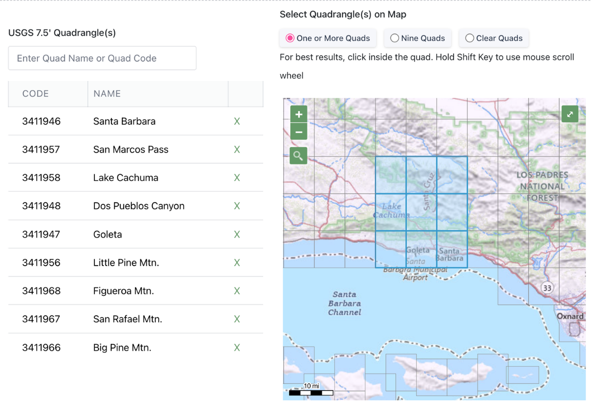
:::
Before the Bio Weaver, species-occurrence analysis involved much more than running a simple search. The information needed to support environmental review was distributed across multiple data sources, reporting workflows and software tools that each require its own search methodology and interpretation. @cr-searchcnps

::: {#cr-searchcnddb}
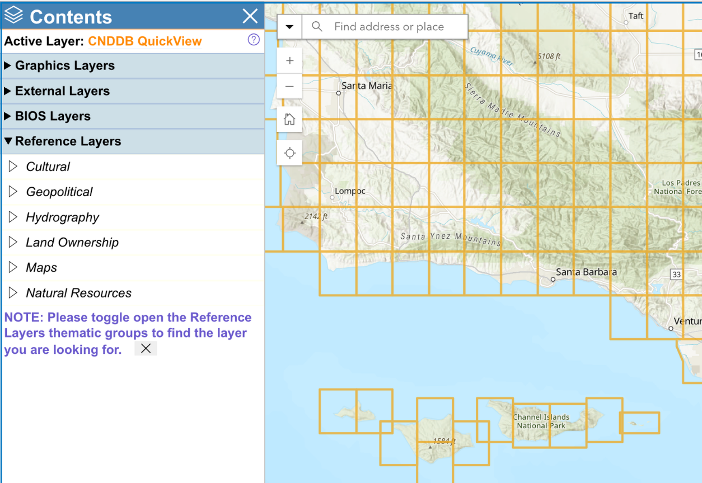
:::

The process often began with separate searches across biological databases. Because datasets store information differently and provide different types of records, biologists needed to retrieve information from multiple sources in order to build a complete understanding of species that may occur within a project area. @cr-searchcnddb

::: {#cr-download}
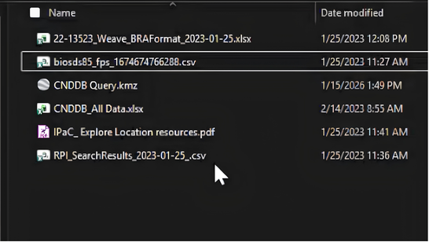
:::

After identifying the relevant searches, the resulting files and reports had to be downloaded, organized, and reviewed. Rather than working from a single source of truth, project information was often spread across numerous files that required additional processing before it could be used. @cr-download

::: {#cr-crossval}
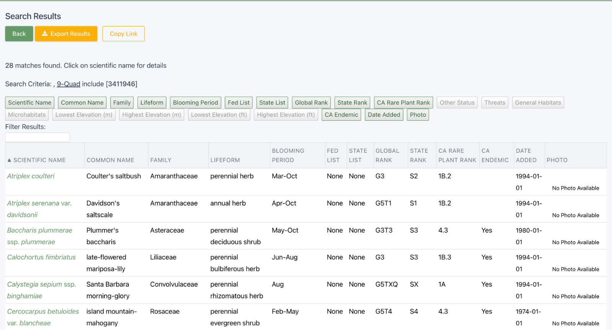
:::

Retrieving all of the data was only the beginning. Results from different sources needed to be compared and cross-referenced to verify observations, reconcile differences between datasets and ensure that relevant records were not overlooked. @cr-crossval

::: {#cr-datacleaning}
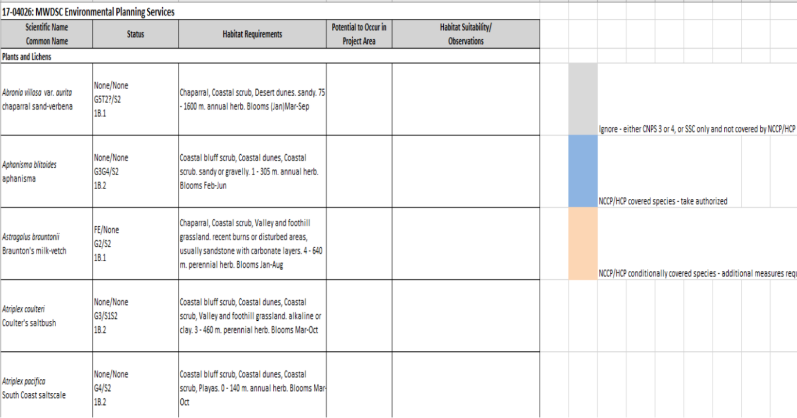
:::

Once collected, the records required additional formatting and cleaning to make them suitable for analysis and reporting. Much of this work involved manually organizing information into structures that could later be incorporated into biological review documents. @cr-datacleaning

::: {#cr-maplayers}
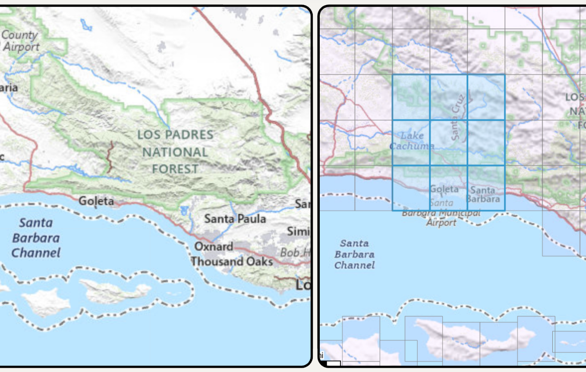
:::

Spatial analysis introduced another layer of complexity. Search areas often needed to be represented geographically, requiring the creation of multiple spatial layers corresponding to different search criteria and regulatory requirements. @cr-maplayers

::: {#cr-generatemap}
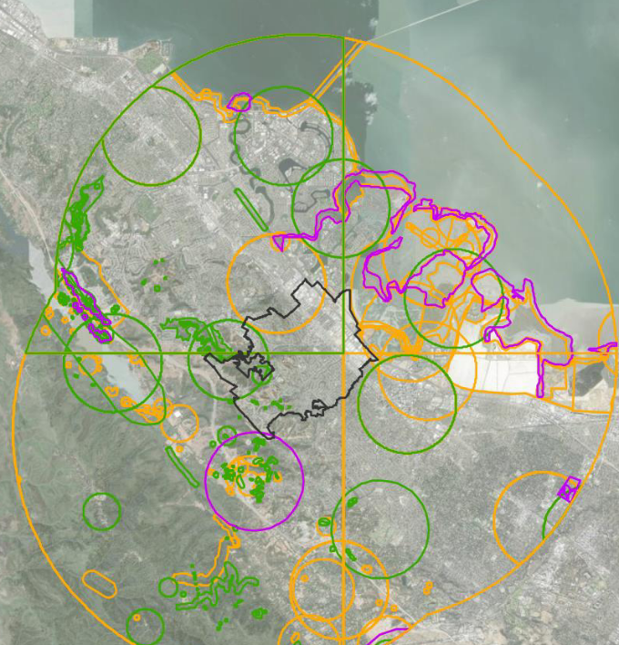
:::

Those layers could then be combined with species occurrence information to generate project-specific maps and spatial summaries for interpretation. @cr-generatemap

::: {#cr-generatepto}
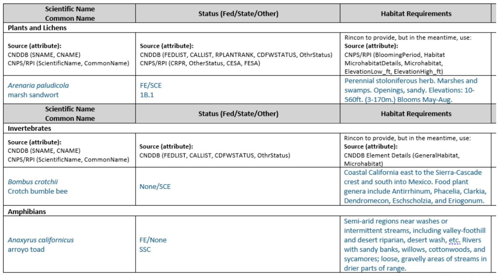
:::

The final challenge was translating all of this information into a report-ready format. Biologists ultimately needed to synthesize records from multiple sources into Potential-to-Occur (PTO) tables and regulatory deliverables that supported environmental review. @cr-generatepto

::: {#cr-diagram}
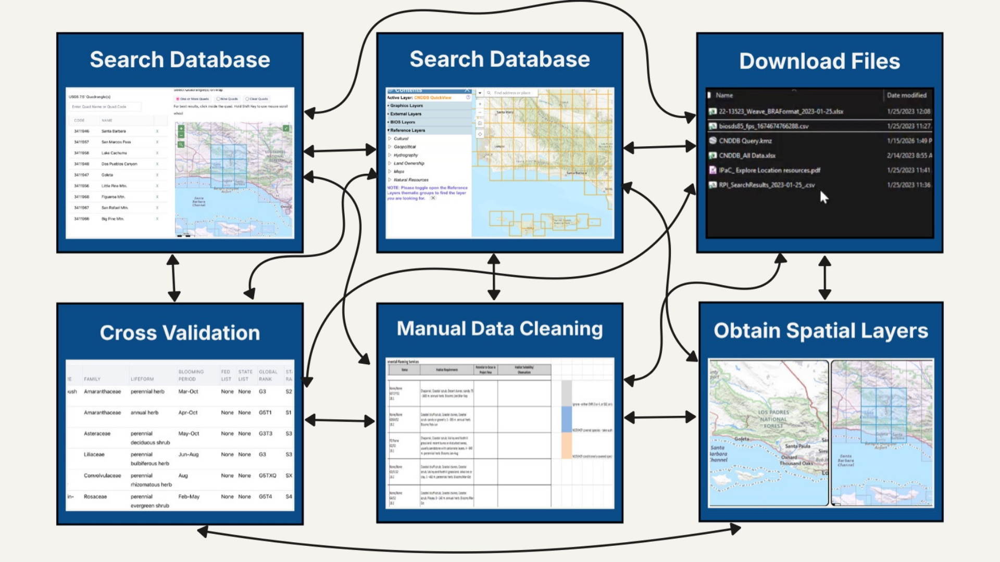
:::

Importantly, these tasks were not always performed in a simple linear sequence. Information often needed to be revisited, validated, reformatted, or supplemented with additional searches as new findings emerged during the review process. @cr-diagram

The result was a workflow that relied heavily on manual effort, repeated data preparation, and multiple disconnected tools. While each step provided valuable information, the overall process required considerable time and attention before meaningful analysis and reporting could begin.  
:::
::::

## Designing a Better Workflow

The fragmented workflow highlighted a broader challenge than simply retrieving species occurrence data. Rincon's biologists needed a process that was not only faster, but also more consistent, reproducible, and easier to maintain across projects. Their goal was to move beyond a collection of disconnected tasks and create a unified workflow that could guide users from project setup to report generation within a single environment.

At the start of the project, Rincon identified several core requirements. The final product needed to accept project-specific spatial inputs, automate the retrieval of species occurrence data from multiple biological datasets, and generate standardized outputs that could support environmental review workflows. The platform also needed to remain maintainable after project handoff so that Rincon's data science and biology teams could continue expanding its capabilities over time.

To meet these requirements, our team focused on three objectives:

### 1. Create a Reproducible Search Workflow

The first objective was to replace a manual process with a repeatable analytical pipeline. Users would define a project boundary and search criteria, while the application would handle the underlying spatial processing and dataset queries. This reduced the need for repeated downloads, manual joins, and ad hoc formatting steps.

### 2. Centralize Data Exploration

The second objective was to provide a single location where biologists could explore project-specific results. Rather than switching between spreadsheets, GIS software, and external databases, users would be able to review maps, raw records, summary visualizations, and reporting tables within the same application.

### 3. Generate Report-Ready Outputs

The final objective was to support the creation of Potential-to-Occur (PTO) reports. The workflow needed to transform occurrence records from multiple datasets into a standardized reporting format that biologists could review, edit, and export for use in environmental assessments. Producing report-ready outputs was a central requirement of the project and one of the primary ways the tool would integrate into existing biological review practices.

These requirements ultimately shaped the design of Bio Weaver. Rather than functioning as a standalone visualization tool, the application was designed as an end-to-end workflow that connects project boundaries, species occurrence databases, spatial analysis, and regulatory reporting into a single repeatable process.

::: {.closeread}
## Building the Bio Weaver
::: {.cr-section}

::: {#cr-upload}
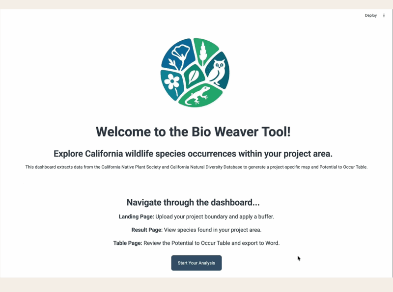
:::

The Bio Weaver workflow begins with a project boundary uploaded by the user. Once loaded, the application displays a preview map so biologists can confirm that the correct site has been provided before continuing with the analysis. @cr-upload 

::: {#cr-search}
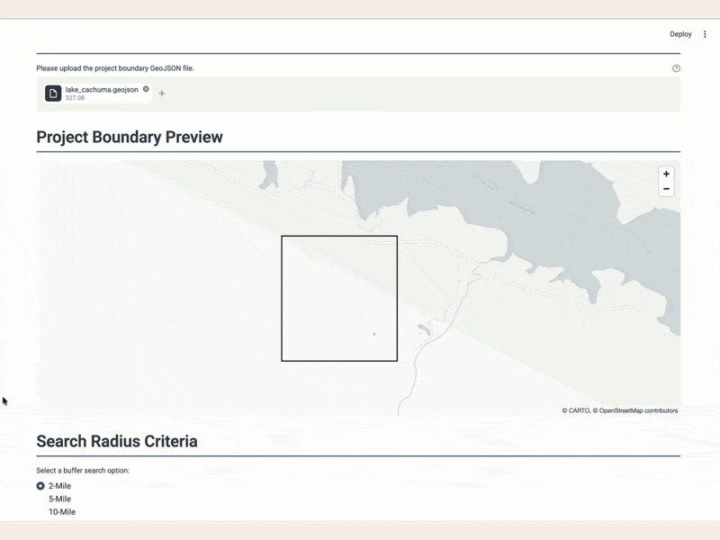
:::

After verifying the project boundary, users select the search criteria that will be used to identify relevant species occurrences. The application previews the resulting search area, allowing users to understand the geographic extent that will be evaluated. @cr-search

::: {#cr-map}
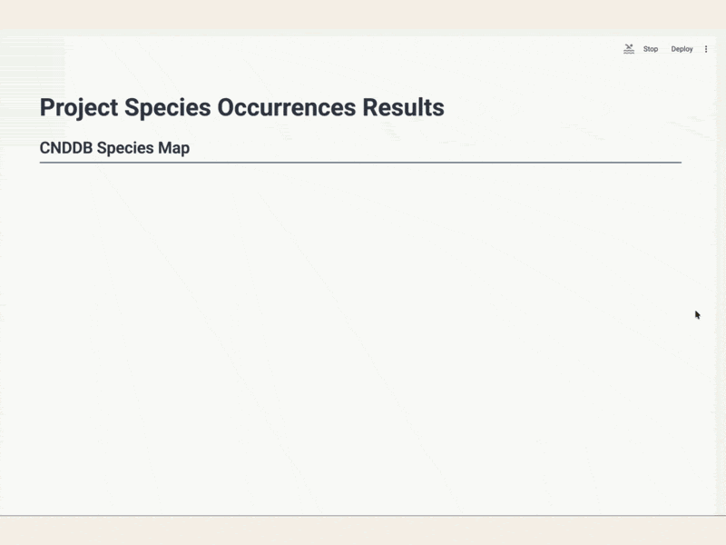
:::

Once processing is complete, the Bio Weaver tool presents project-specific occurrence records in an interactive map. Plant and animal occurrences are symbolized separately, which helps users quickly identify which records fall within the selected search area and their spatial relationship to the project footprint. @cr-map

::: {#cr-chart}
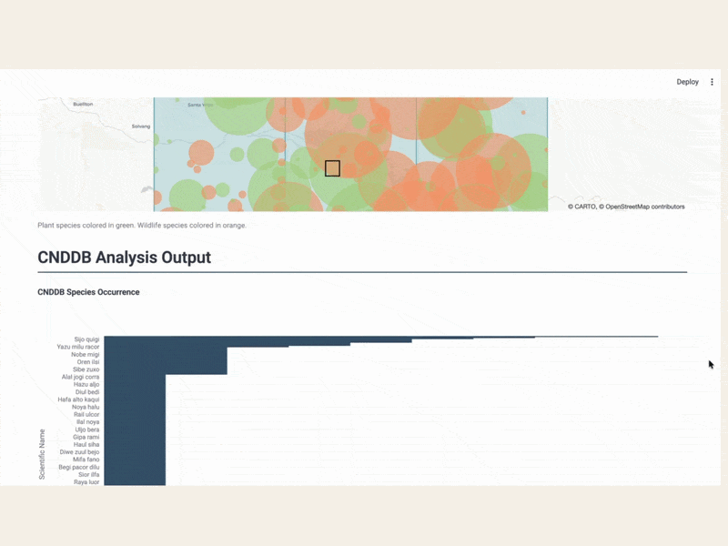
:::

Beyond mapping, the Bio Weaver summarizes occurrence data through visualizations that help users understand patterns in the results. The application generates a frequency chart to provide an overview of which species appear most often within the returned records and support exploratory analysis. @cr-chart

::: {#cr-tables}
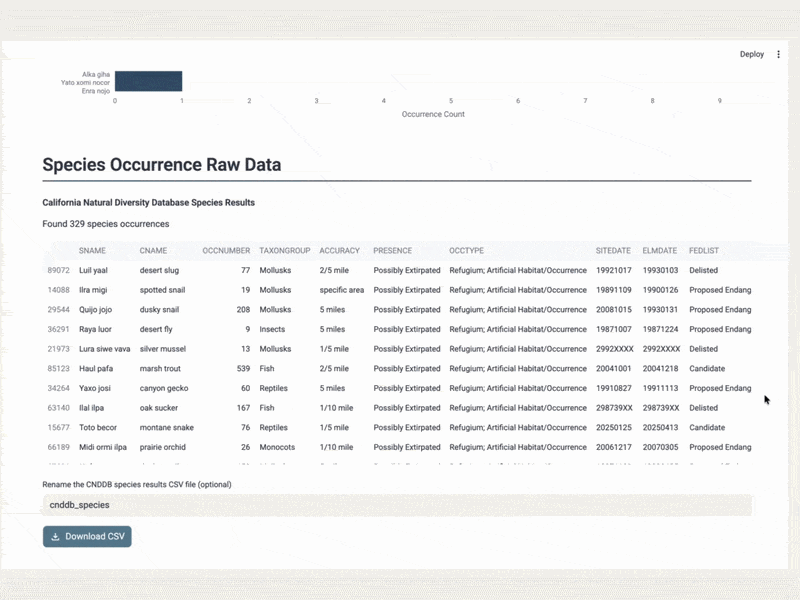
:::

Transparency was an important design consideration for this project. In addition to visualizations, users can inspect the original query results returned by each dataset independently to provide direct access to the underlying records used throughout the workflow. @cr-tables

::: {#cr-ptobuilder}
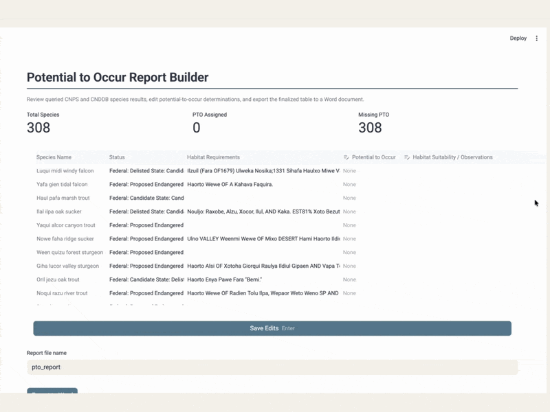
:::

The Potential-to-Occur (PTO) Report Builder transofrms species records into a format designed for environmental review and reporting. Users can review, edit and refine the generated table directly within the application, making it easier to prepare reporting deliverables. @cr-ptobuilder

::: {#cr-report}
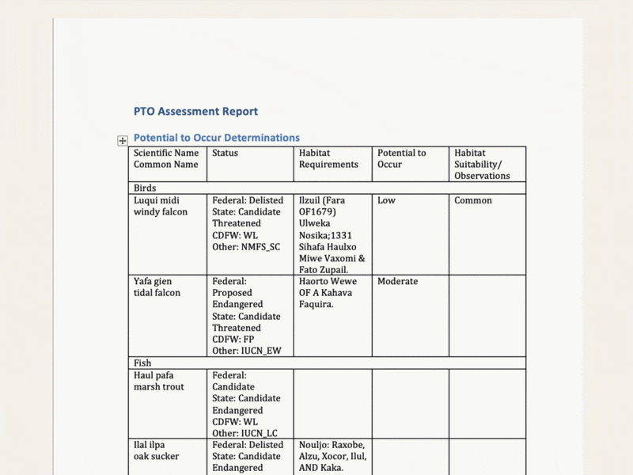
:::

After reviewing and saving their edits, users can export the PTO results as a Word document, The exported report preserves modifications made within the application and produces a standardized output that can be incorporated into Rincon's broader biological review workflow. @cr-report

:::
:::

## Behind the Scenes: Data Pipeline & Processing

::: {.closeread}
::: {.cr-section}

What actually happens after the user clicks Start Analysis? 

::: {#cr-start}
_While the interface simplifies the experience for users, a series of automated data-processing, spatial-query and reporting workflows operate behind the scenes to transform project boundaries into report-ready outputs. The next section explores how the Bio Weaver tool processes and integrates species occurrence data behind the scenes._
:::

The platform is composed of structured Python scripts that take on a sequence of automated tasks as the user moves along the tool. @cr-start

::: {#cr-d1}
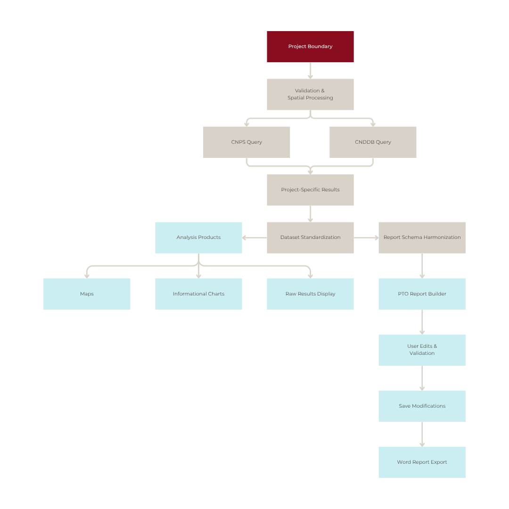
:::

The workflow starts after the user uploads a project boundary. This file must be a KMZ format. @cr-d1

::: {#cr-d2}
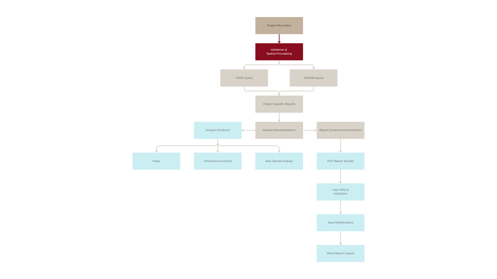
:::

Before any species records can be retrieved, the boundary must be validated and standardized to ensure that subsequent spatial operations are performed correctly. Depending on the selected search criteria, the application generates an appropriate search area around the project site and identifies the geographic units required to query biological datasets. After the user selects a search distance, the application performs the task of creating the search distance and mapping that. What the user doesn't see is that it is already filtering the datasets in the search distance even before they click the results page. @cr-d2

::: {#cr-d3}
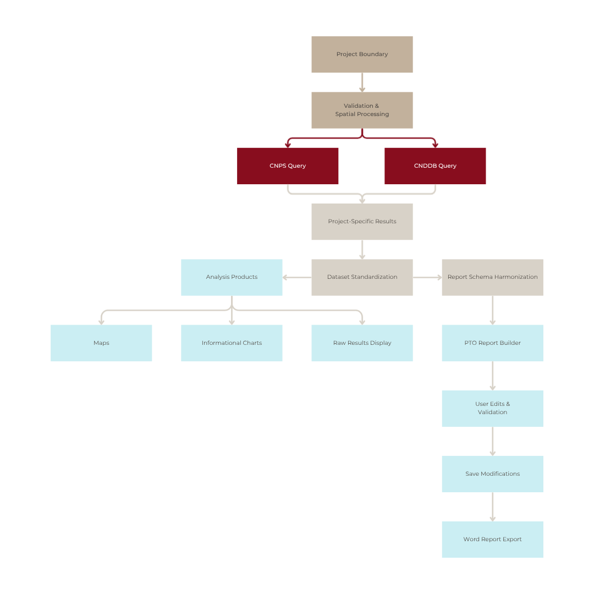
:::

Once the search area has been established, the Bio Weaver retrieves project-specific species occurrence information from multiple biological databases. Because the underlying datasets use different structures and methods for storing location information, separate query methodologies are applied to each source. This allows the application to return records relevant to the selected project area while accounting for differences between datasets. @cr-d3

::: {#cr-d4}
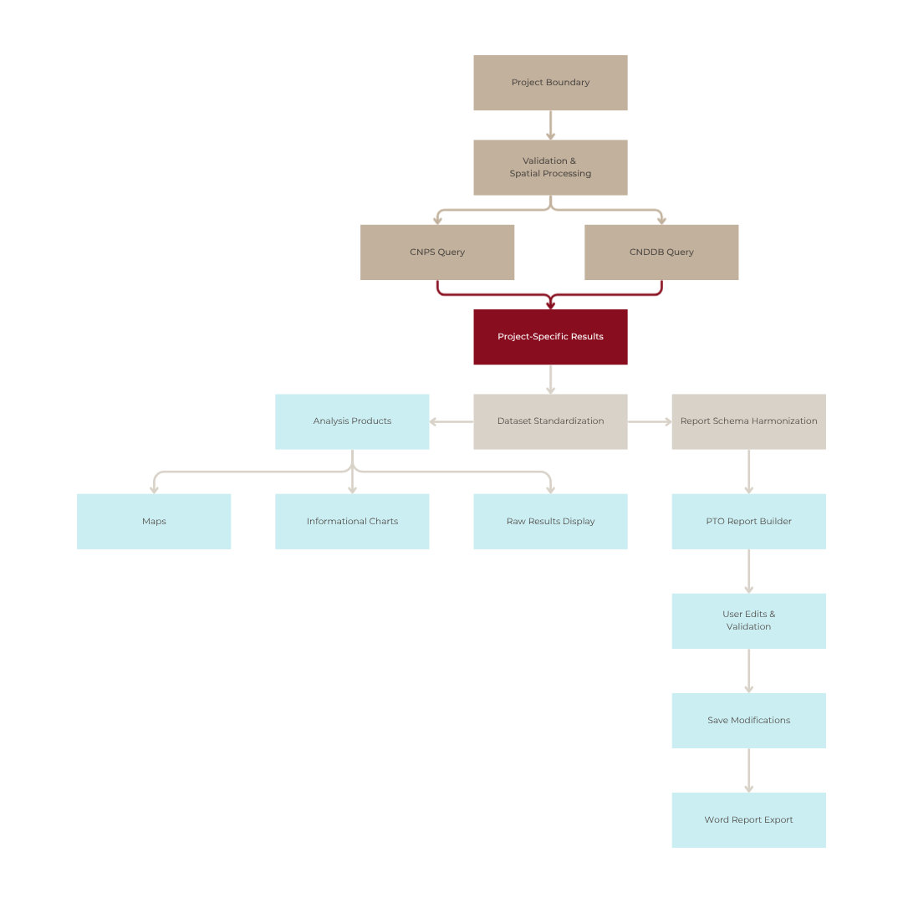
:::

The Bio Weaver compiles the returned records as separate entities for traceability and maintenance of the results. @cr-d4

::: {#cr-d5}
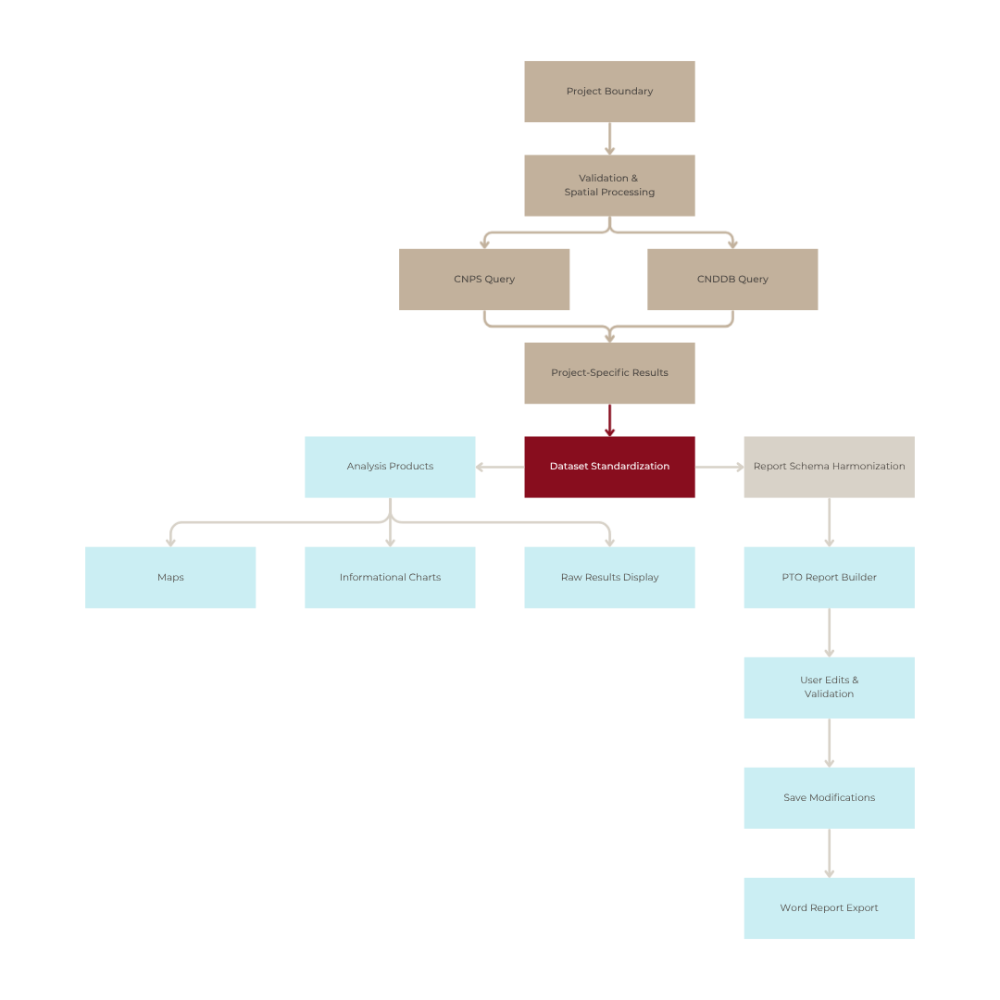
:::

The records returned from each dataset are organized into a consistent structure for downstream analysis. Standardizing the results enables information from multiple sources to be explored together while maintaining the original query outputs for transparency and review. This integration step provides the foundation for the visualizations and reporting workflows generated later in the process. @cr-d5

::: {#cr-d6}
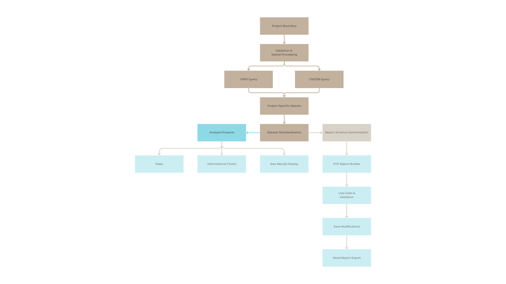
:::

Once standardized, the occurrence records are transformed into user-facing analysis products. @cr-d6

::: {#cr-d7}
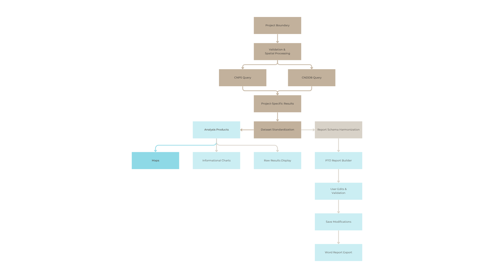
:::

Bio Weaver produces interactive maps, summary visualizations, and searchable result tables that allow biologists to explore occurrence patterns within the project area. These outputs provide multiple perspectives on the returned records while preserving access to the underlying data. @cr-d7

::: {#cr-d10}
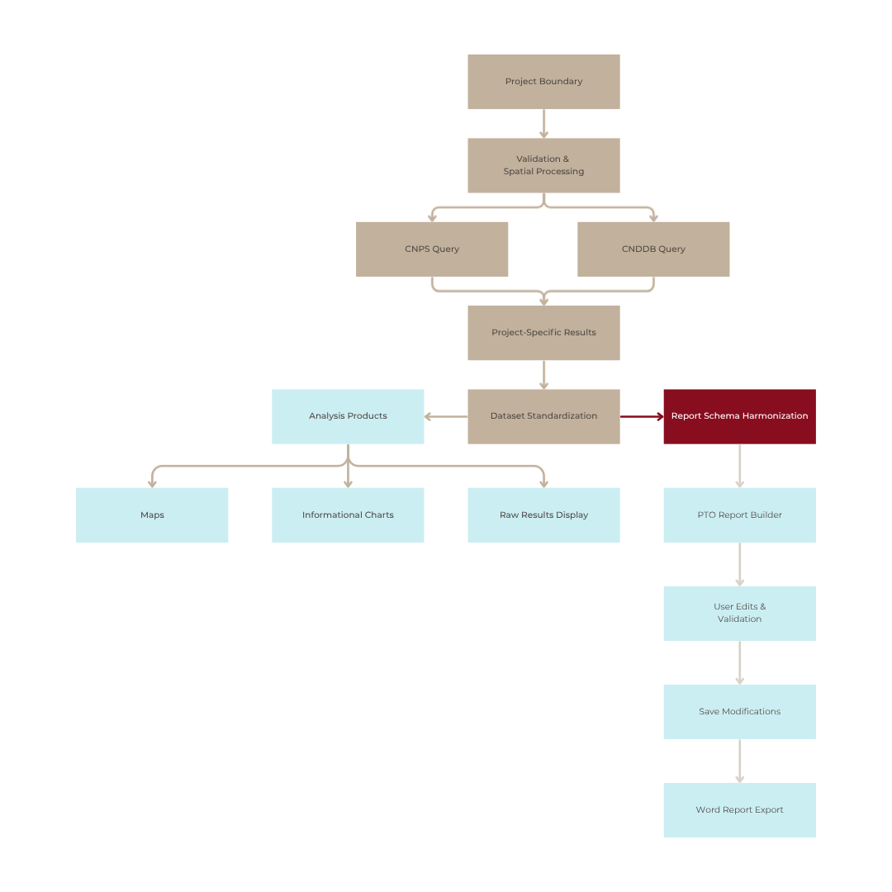
:::

Reporting introduces a separate data-processing workflow. Although the datasets can be analyzed together, their structures differ substantially and are not immediately compatible with the format required for Potential-to-Occur (PTO) reporting. To support report generation, the application further harmonizes the results into a common reporting schema. This process reconciles differences in field names and structure, prevents duplicate information from propagating through the workflow, and creates a standardized foundation for the PTO table. @cr-d10

::: {#cr-d11}
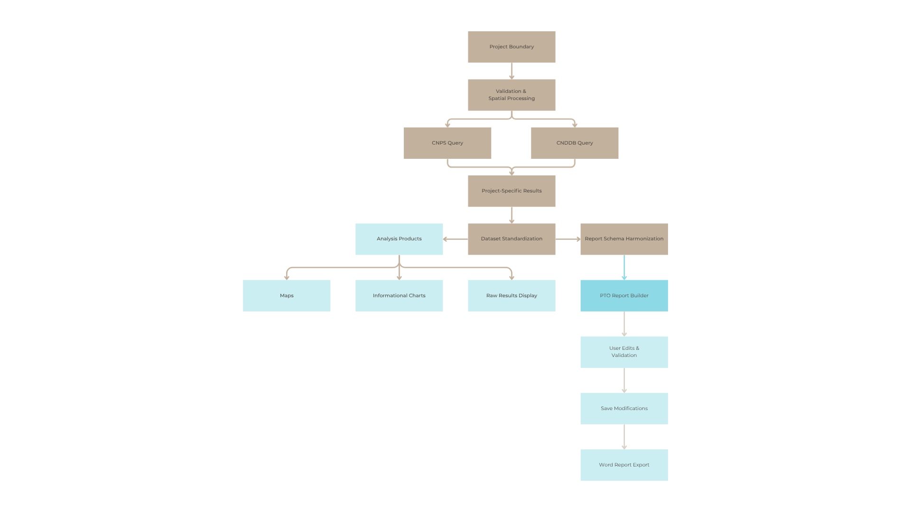
:::

The resulting PTO table can be reviewed and edited directly within the application. Any modifications made by the user are preserved and incorporated into the final output. @cr-d11

::: {#cr-d14}
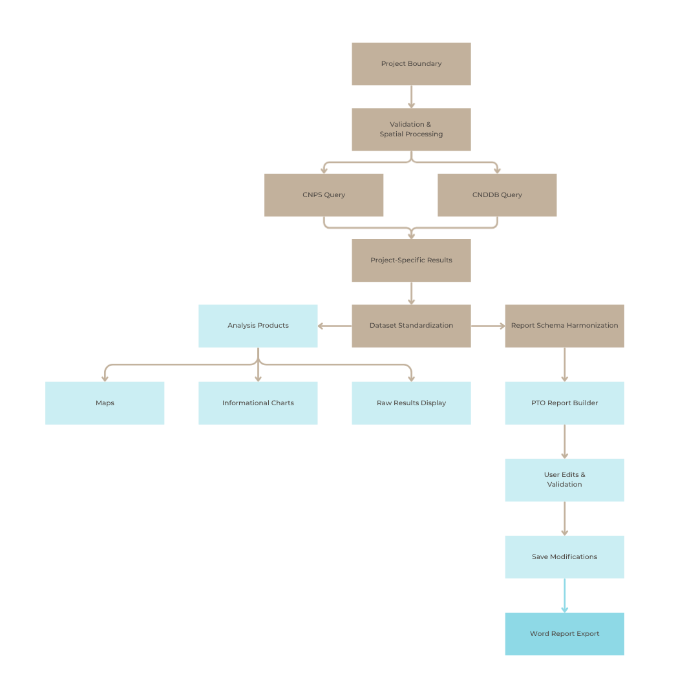
:::

The resulting PTO table can be reviewed and edited directly within the application. Any modifications made by the user are preserved and incorporated into the final output. @cr-d14

:::
:::

## Designing for Real Users

Throughout the process of developing this tool, we kept in mind that it will be used by biologists in their everyday work, many who do not have coding experience. 

Because of this, we decided to simplify the format of the spatial boundary by having it accept only a single file type (KMZ), to save them the headache of handling different file formats for the same thing. 

The search distance options are based on the biologist's reporting needs. Some regulatory reports require a variety of different search criteria, and this feature on the platform reflects these project-specific needs. 

The PTO report structure is based on the fact that they have to often draft that report from scratch. By partially automating the report, we save the biologist time entering every species' information one-by-one. 

Streamlit was selected as the framework to use to build this tool for a few reasons related to time-constraints, longevity of the tool, and economic reasons. First, the framework allowed us to prototype and build this app in a relatively short period of time. We wanted something that was not too focused on the styling but that was also 'easy' to build. Other frameworks required a longer development period and we were focused on making the most complete possible platform that biologists could readily use once handed over to the company. Secondly, we were thinking about the long-term lifespan of the tool, and it's ability to be continuously built by the Rincon tech team. We handed over an app that the Rincon could find intuitive to understand the codebase and build upon. Lastly, other frameworks required subscription based deployment and use once the app was built. We decided to use Streamlit since it is an open source framework that didn't require having the company divest resources for the biologists to access. 

Our decision to use Docker also comes from thinking about the biologist's ability to deploy the app without having to access a terminal. While it does require some extra steps to download initially, after download, the app can be deployed at any time. 

-- draft

Building Bio Weaver required more than connecting datasets and automating analysis. Because the application was being developed for practicing environmental consultants, many of the project's most important decisions involved balancing technical possibilities with the realities of day-to-day biological review.

Throughout development, our team worked closely with Rincon stakeholders to understand how biologists currently conduct species searches, review occurrence records, and prepare regulatory reports. These conversations helped shape a series of design decisions intended to make the application both practical and maintainable.

Simplifying Project Inputs

One early decision was to limit the application to a single project boundary at a time. While it would have been possible to support more complex workflows involving multiple sites, focusing on one project area aligned with Rincon's existing review process and reduced unnecessary complexity for users.

Similarly, the application accepts a standardized boundary file format and validates its contents before running the analysis. This approach reduced opportunities for input errors and helped ensure consistency across projects.

Supporting Regulatory Search Requirements

Species searches are often governed by established regulatory and organizational practices. Rather than requiring users to manually define search distances, Bio Weaver provides predefined search options that correspond to common review workflows, including multiple buffer distances and the 9-quadrangle search methodology.

By integrating these options directly into the application, users can conduct analyses using familiar criteria while maintaining a standardized workflow.

Balancing Transparency and Automation

A major project goal was to automate repetitive tasks without obscuring the underlying data. While Bio Weaver generates maps, charts, and reporting outputs automatically, users retain access to the original query results from each dataset.

This balance between automation and transparency allows biologists to inspect source records, verify results, and maintain confidence in the information used to support environmental review.

Designing Around Existing Reporting Workflows

One of the most important design considerations involved the Potential-to-Occur (PTO) workflow. Rather than generating a completely new reporting format, the PTO Builder was designed to mirror the structure and organization of reports already familiar to Rincon's biological staff.

Species categories, reporting conventions, and editable review workflows were incorporated directly into the application so that the transition from analysis to reporting felt like a natural extension of the existing process.

Building for Future Growth

The project was also designed with long-term maintainability in mind. By developing the application in Streamlit and documenting the underlying workflow, the platform can continue evolving after project handoff. Future enhancements can build upon the existing framework without requiring the application's core workflow to be redesigned from scratch.

Ultimately, many of Bio Weaver's most important technical decisions were guided by a simple question:

How can we reduce the amount of time spent preparing data while preserving the flexibility and transparency needed for environmental review?

The resulting application combines automation, analysis, and reporting within a workflow designed around the needs of its users rather than the underlying technology alone.

This transitions very naturally into Results & Impact, where you can finally answer:

What changed once Bio Weaver was implemented?

## Results & Impact

Bio Weaver was designed to reduce the amount of time biologists spend preparing and organizing data so they can focus on evaluating species occurrence information and supporting environmental review. By combining data retrieval, spatial analysis, visualization, and reporting into a single workflow, the application streamlines tasks that were previously distributed across multiple platforms and file formats.

Before Bio Weaver, project-specific species information often required searching multiple databases, manually organizing downloaded files, validating results across sources, preparing maps, and formatting information for reporting. Much of the effort was concentrated on moving information between tools rather than analyzing the results themselves.

With Bio Weaver, these steps are integrated into a single workflow. Users can move from project boundary definition to project-specific species occurrence analysis, map exploration, and report generation without repeatedly recreating the same processing steps for each project.

A Unified Workflow

One of the project's most significant outcomes was the creation of a repeatable workflow that connects data retrieval, spatial analysis, and reporting within a single application. Rather than treating each stage as a separate task, Bio Weaver guides users through a consistent process from project setup to final deliverables.

This consistency helps reduce opportunities for error while making analyses easier to reproduce across projects.

Improved Access to Information

The application provides multiple ways to explore species occurrence records, including interactive maps, summary visualizations, and access to the underlying query results. By presenting information in several formats, users can move between high-level summaries and detailed records without leaving the application.

This approach improves transparency and supports different stages of the biological review process.

Streamlined Reporting

The PTO workflow represents one of the most practical outcomes of the project. By transforming records from multiple datasets into a common reporting structure, Bio Weaver reduces the effort required to prepare report-ready tables while preserving the ability for users to review and edit results before export.

The automated Word export further extends this workflow by generating a deliverable that can be incorporated directly into existing reporting processes.

From Data Collection to Decision Support

Ultimately, the value of Bio Weaver lies not in any individual feature, but in the way those features work together. The platform brings project boundaries, occurrence records, spatial analysis, visual exploration, and reporting into a cohesive workflow designed around the needs of environmental consultants.

Rather than spending time assembling information from disparate sources, biologists can focus on interpreting results, evaluating species occurrence patterns, and supporting the environmental review process.

Note: All screenshots and demonstrations shown in this case study use synthetic or publicly available data. The production version of Bio Weaver was developed for Rincon Consultants and is not publicly accessible.

## My Contributions

As a team project, the Bio Weaver Tool benefited from the contributions of multiple developers, analysts, and stakeholders. My work focused on application design, reporting workflows, data transformation, and documentation, with an emphasis on creating a tool that could be maintained and expanded after project handoff.

Advocating for Streamlit

One of my riskiest contributions to the project came before a single line of application code was written. During the early planning stages, our team evaluated several possible frameworks, including Shiny, Dash, and Streamlit. Given the capstone timeline and our project requirements, I advocated for using Streamlit as the application's primary framework.

My reasoning was straightforward: Streamlit offered a relatively low barrier to development, integrated naturally with the Python ecosystem we were already using, and allowed us to rapidly prototype user-facing workflows without sacrificing functionality. While selecting a framework may seem like a small decision, it ultimately shaped how we approached development throughout the project and contributed to our ability to deliver a working application within the capstone timeframe.

Building the PTO Reporting Workflow

The contribution I am most proud of was developing the reporting workflow behind the Potential-to-Occur (PTO) Report Builder.

Although the application retrieved records from both CNPS and CNDDB, the datasets differed considerably in their structure and field naming conventions. To support a unified PTO workflow, I developed logic that further harmonized the schema of both datasets without modifying the original query outputs. This allowed users to inspect the raw source records while simultaneously working with a standardized reporting structure.

In addition to schema harmonization, I worked to ensure that duplicate information was not propagated into the reporting workflow. These transformations provided the foundation for the editable PTO table within the application and enabled the automated Word report export process while preserving user modifications.

Improving the User Workflow

Throughout development, I contributed to discussions surrounding usability and workflow design. Because the application's primary users were environmental consultants rather than software engineers, it was important that the interface support the tasks biologists already performed rather than require them to learn an entirely new process.

This included contributing to the design of the PTO review workflow, helping organize outputs into intuitive formats, and supporting the transition from species query results to report-ready products.

Documentation and Knowledge Transfer

Every script I worked on included thorough documentation, with the understanding that the codebase would eventually be transferred to Rincon after project completion. Clear documentation was critical not only for maintainability, but also for ensuring that future analysts and developers could understand the decisions, assumptions, and workflows embedded within the application.

Building software for a real client reinforced an important lesson: successful projects are not measured solely by whether the code works. They must also be understandable, maintainable, and useful to the people who inherit them after development is complete. 

## Lessons Learned

Working on Bio Weaver was one of the most rewarding experiences of my graduate program because it allowed me to develop a solution for a challenge I could personally relate to. Prior to becoming a data scientist, I worked as an Environmental Specialist, where many of my daily responsibilities involved repetitive data collection, organization, and reporting tasks. Because of that experience, I immediately understood why Rincon's biologists were looking for a way to reduce the amount of time spent preparing information and increase the amount of time available for analysis and decision-making.

One of the most important lessons I learned was that streamlining a workflow requires first understanding the workflow in its entirety. Before writing code or designing interfaces, we had to identify, document, and understand every step that users performed, including the small tasks that often go unnoticed. By mapping the process from data retrieval to reporting, I learned that successful automation is rarely about eliminating a single task. Instead, it is about understanding how individual tasks connect to form a larger workflow and identifying where technology can provide the greatest value.

This project also taught me how to balance client expectations with technical feasibility. Stakeholders naturally want tools that can solve every problem and support every possible workflow, but development requires making thoughtful tradeoffs. Throughout the project, our team continuously evaluated which features would provide the greatest benefit within the project's timeline while still creating a foundation that could be expanded in the future. Learning to navigate that balance helped me think more critically about project scope, prioritization, and long-term maintainability.

Perhaps most importantly, Bio Weaver taught me how to think like a developer rather than solely as an analyst. Instead of focusing only on producing results, I learned to think about user experiences, system architecture, maintainability, and future growth. User stories became an invaluable tool throughout the project because they shifted our perspective from what the application could do to what users actually needed it to do.

Looking back, one of my biggest takeaways is that building software for real users is ultimately an exercise in empathy. Effective tools are not created by starting with technology and searching for a problem. They are created by understanding how people work, identifying the challenges they face, and designing solutions that integrate naturally into their existing workflows. Bio Weaver gave me my first opportunity to apply that mindset in a client-facing development environment, and it fundamentally changed the way I think about designing data products.

## Future Directions

While Bio Weaver successfully brings species querying, analysis, and reporting into a unified workflow, there are several opportunities for future expansion. Because the application was designed with maintainability and extensibility in mind, additional functionality could be incorporated without fundamentally changing its core architecture.

Expanding Data Sources

One potential enhancement would be the integration of additional biological and environmental datasets. Incorporating new sources could provide users with a more comprehensive view of project-specific ecological information while reducing the need to consult external databases outside the application.

Supporting Multi-Project Comparisons

The current implementation focuses on a single project area at a time, reflecting Rincon's existing workflow. Future versions of the application could enable users to compare multiple project sites simultaneously, allowing teams to evaluate species occurrence patterns across locations and investigate differences between potential project alternatives.

Enhancing Data Visualization

Although Bio Weaver currently provides interactive maps and summary charts, additional visualization tools could further support analysis and reporting. Expanded charting options, filtering capabilities, and alternative map visualizations could provide users with new ways to explore occurrence records and communicate findings.

Continued Workflow Automation

Future development could also further streamline the transition from analysis to reporting. Additional report templates, export formats, and automated summarization features could reduce manual effort while maintaining the transparency and flexibility required for environmental review workflows.

Ultimately, Bio Weaver was designed as a foundation rather than a finished endpoint. The project's modular architecture provides Rincon with a platform that can continue evolving alongside the needs of its biologists, analysts, and environmental review processes.

## Project Resources

::: {.grid}

::: {.g-col-6}
Watch our team's full presentation at the 2026 MEDS Capstone showcase!

<iframe title="vimeo-player" src="https://player.vimeo.com/video/1206270711?h=4f334a5504" width="640" height="360" frameborder="0" referrerpolicy="strict-origin-when-cross-origin" allow="autoplay; fullscreen; picture-in-picture; clipboard-write; encrypted-media; web-share"   allowfullscreen></iframe>
:::

::: {.g-col-6}
Other project resources:

[Slide Deck](resources/public-presentation-slides.pdf){.btn .btn-secondary role="button"}

[Project pProposal](resources/proposal.pdf){.btn .btn-secondary role="button"}

[Technical Documentation](resources/bioweavers_TechnicalDocumentation.pdf){.btn .btn-secondary role="button"}
:::

:::

## Acknowledgements

